# WorkflowX Configurator


WorkflowX Configurator turns sprawling ComfyUI graphs into selectable workflow profiles: reuse the same key names in different groups, switch one config, and the right value or relay source is picked at queue time. Instead of duplicating samplers, rewiring LoRA chains, or fighting nodes that can only store one global value, WorkflowX lets fast drafts, quality renders, model variants, and LoRA experiments live side by side while one selector decides which path is active. It can be used for multiple scenarios where you want to have one workflow to easily switch values of any node by preconfigure once or to switch between different profiles instead of creating separate workflows.


## Quick Links

- [WorkflowX Configurator Nodes](#workflowx-configurator-nodes)
- [XFlows Workflow Manager](#xflows-workflow-manager)
- [XPrompts Prompt Library](#xprompts-prompt-library)
- [XNodes Node Snips](#xnodes-node-snips)
- [WorkflowX Settings, Import, and Export](#workflowx-settings-import-and-export)
- [AFJ Visual JSON Tools](#afj-visual-json-tools)
- [Troubleshooting](#troubleshooting)

## What It Does

- Defines workflow-local values with typed `Set` nodes.
- Reads values anywhere else with matching typed `Get` nodes.
- Lets each `Group Configurator` describe how every named ComfyUI group should behave.
- Lets one `Config Selector` choose exactly one configuration at a time.
- Applies group modes immediately in the canvas.
- Materializes Get values just before queueing, so repeated config switches do not require a browser refresh.
- One variable name removes any if/else logic routing. Simply the active path feeds the variable.

The package appears in ComfyUI's add-node menu under:

```text
WorkflowX_Configurator
```

## Bundled Tools

This repository also packages:

- `XFlows`, an advanced workflow manager sidebar.
- `XPrompts`, a prompt library and preset snippet side panel.
- `XNodes`, a saved node and node-group snippets side panel.
- `AFJ - Visual Builder`, `AFJ - Template Randomizer`, and `AFJ - Prompt Template Importer`.

These tools keep their existing node names, frontend extension IDs, and backend route prefixes for compatibility.

## Installation

WorkflowX Configurator is available through ComfyUI Manager. Open Manager, search for `WorkflowX Configurator`, install it, then restart ComfyUI.

You can also install it manually by cloning this repository into your ComfyUI `custom_nodes` directory, or by copying this folder there:

```text
ComfyUI/
  custom_nodes/
    WorkflowX-Configurator/
      __init__.py
      nodes.py
      xflows_manager.py
      afj_awesome_flex_json_v2/
      web/js/key_config_tools.js
      web/js/xflows.js
      web/js/xflows_library.js
```

Restart ComfyUI, then hard refresh the browser.

ComfyUI Manager installs published Registry releases. Git changes do not become Manager updates until the Registry version is bumped and published.

## WorkflowX Configurator Nodes

### Typed Set/Get Nodes

WorkflowX uses separate typed nodes instead of one dynamic output node. This keeps ComfyUI socket validation predictable.


| Setter | Getter | Output type |
| --- | --- | --- |
| `Set Int` | `Get Int` | `INT` |
| `Set Float` | `Get Float` | `FLOAT` |
| `Set String` | `Get String` | `STRING` |
| `Set Text` | `Get Text` | `STRING` multiline value |
| `Set Boolean` | `Get Boolean` | `BOOLEAN` |
| `Set Sampler` | `Get Sampler` | ComfyUI sampler combo |
| `Set Scheduler` | `Get Scheduler` | ComfyUI scheduler combo |
| `Set Relay` | `Get Relay` | wildcard runtime value |

Each `Set` node has:

- `key`: the name to publish, for example `Steps` or `CFG`.
- `value`: the typed value.

Each `Get` node has:

- `key`: the name to read.
- hidden internal fields managed by the frontend extension.

`Set Sampler` and `Set Scheduler` use ComfyUI's native sampler and scheduler option lists, so their Get nodes can be connected to sampler/scheduler inputs after those widgets are converted to inputs.


### Set Relay / Get Relay

`Set Relay` and `Get Relay` route live ComfyUI graph values by key. They are for runtime objects such as `MODEL`, `CLIP`, `VAE`, `LATENT`, `CONDITIONING`, `IMAGE`, or `MASK`.

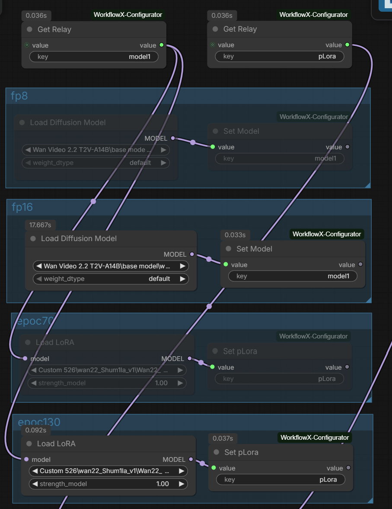

Relays are different from typed Set/Get nodes:

- typed Set/Get nodes store serialized widget values.
- Relay nodes route an actual graph connection into the queued prompt.
- one Relay carries one output value.

For checkpoint switching, use three relay keys:

- checkpoint `MODEL` output -> `Set Relay` key `base_model`
- checkpoint `CLIP` output -> `Set Relay` key `base_clip`
- checkpoint `VAE` output -> `Set Relay` key `base_vae`

Then use matching `Get Relay` nodes wherever those values are needed.

For LoRA switching, place the LoRA loader inside a configured group, then connect its `MODEL` output into `Set Relay` key `pLora`. A downstream `Get Relay` key `pLora` can feed another LoRA loader or a sampler model input. The LoRA loader's checkpoint, epoch, strength, and other settings are preserved because the relay routes the loader's output object.

Relay routing uses the same scope rules as typed values. The selected source is patched into the queued prompt only; visible canvas links are not changed.

### Group Configurator

`Group Configurator` defines one named profile, such as `Speed`, `Quality`, or `Realism`.


It shows:

- `config_name`: the profile name.
- `Refresh groups`: rescan ComfyUI group frames after adding, deleting, or renaming groups.
- one dropdown per configured group, with `Active`, `Bypass`, `Mute`, and `Ignore`.

Mode meanings:

- `Active`: nodes in the group are normal and eligible for config-scoped Set/Get values.
- `Bypass`: nodes in the group are bypassed in the canvas and ignored for config-scoped Set/Get values.
- `Mute`: nodes in the group are muted in the canvas and ignored for config-scoped Set/Get values.
- `Ignore`: WorkflowX leaves the canvas state unchanged and treats values in the group as unscoped/global for lookup.

### Config Selector

`Config Selector` lists all `Group Configurator` names as toggles. Turning one on turns the others off and applies that config immediately.


It shows:

- `Refresh configs`: rescan configurator nodes after adding, deleting, or renaming them.
- `console_output`: choose `yes` to log queue-time Set/Get and Relay resolution details in the browser console.
- one toggle per config name.

### Config Selector Advanced

`Config Selector Advanced` has the same config toggles as `Config Selector`, plus optional scoped group controls:

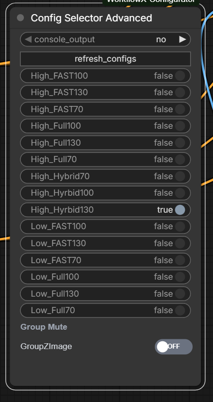

- `Group Mute`: groups assigned to selector mute scope. Toggle off mutes the group, toggle on returns it to active.
- `Group Bypass`: groups assigned to selector bypass scope. Toggle off bypasses the group, toggle on returns it to active.

Advanced selector toggle states are saved with the workflow and applied when changed.

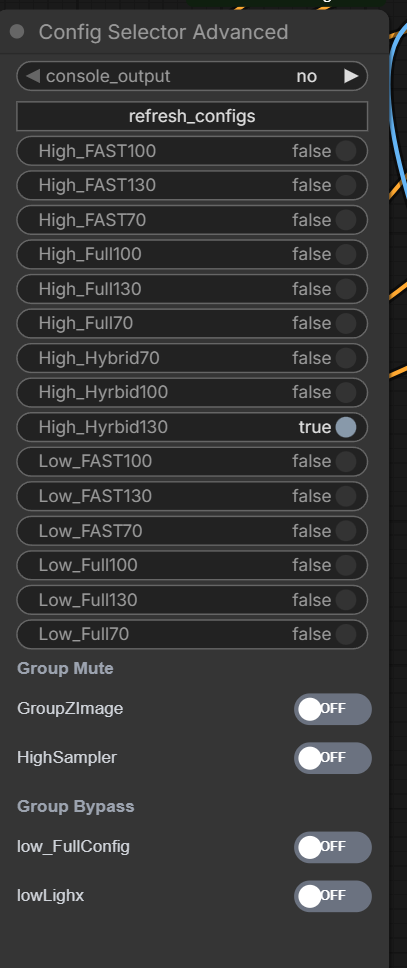

### Group Scopes

`Group Scopes` decides where each canvas group appears. It shows one dropdown per group:

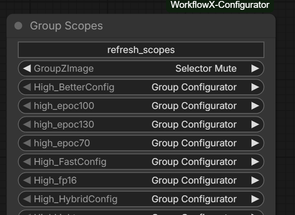

- `Group Configurator`: show the group in Group Configurator nodes.
- `Selector Mute`: show the group in Config Selector Advanced's Group Mute section.
- `Selector Bypass`: show the group in Config Selector Advanced's Group Bypass section.
- `Ignore`: hide the group from both Group Configurator and Config Selector Advanced sections.

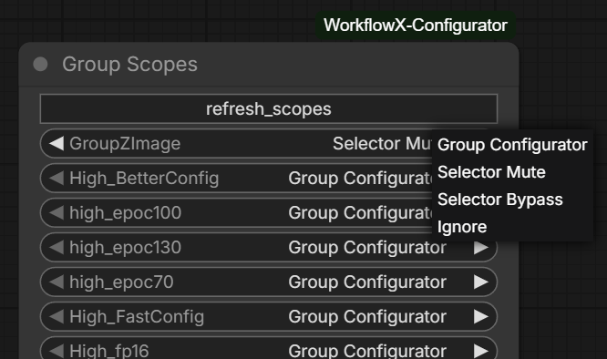

If no Group Scopes node is configured, WorkflowX keeps the original fallback: all groups appear in Group Configurator and none appear in the advanced selector sections. If more than one Group Scopes node exists, scope filtering is disabled and the fallback behavior is used until duplicates are removed.

## Lookup Rules

WorkflowX uses a global-first scope model.

1. If a matching `Set` node is outside configured groups, it is treated as global and wins.
2. If no global Set exists, WorkflowX uses matching Set nodes inside groups marked `Active` by the selected config.
3. Set nodes inside groups marked `Mute` or `Bypass` are ignored.
4. Groups marked `Ignore` are treated as unscoped/global for lookup and do not force canvas mode changes.
5. If duplicates remain at the chosen priority, WorkflowX logs a warning and uses the Set node with the highest node id.

This means you can intentionally place a global `Set Int Steps` outside config groups to override every profile, or place separate `Set Int Steps` nodes inside groups to make each profile choose its own value.

## Queue-Time Resolution

ComfyUI canvas state and serialized workflow metadata can briefly disagree after switching configs. To avoid stale values, WorkflowX resolves every Get node immediately before queueing:

1. The frontend reads the currently selected Config Selector or Config Selector Advanced toggle.
2. It evaluates Set/Get candidates from the live graph.
3. It writes the resolved value into hidden fields on each Get node.
4. The backend validates those hidden fields and returns the materialized value.
5. If the frontend fields are missing, the backend falls back to workflow metadata lookup.

This is why you can run `Speed`, switch to `Quality`, then queue again without refreshing the browser.

Set `console_output` to `yes` on `Config Selector` when debugging large workflows. Queue-time logs include the Get key, selected Set node id, group/global scope, resolved value for typed Get nodes, and selected Relay source node id for Relay nodes.

## Example Scenarios

### Fast Draft vs Quality Render

Create two groups:

- `FasterConfig`
- `RealConfig`

Inside `FasterConfig`:

- `Set Int` key `Steps`, value `4`
- `Set Float` key `CFG`, value `1.0`
- `Set Sampler` key `Sampler`, value `euler`
- `Set Scheduler` key `Scheduler`, value `simple`

Inside `RealConfig`:

- `Set Int` key `Steps`, value `20`
- `Set Float` key `CFG`, value `2.5`
- `Set Sampler` key `Sampler`, value `dpmpp_2m`
- `Set Scheduler` key `Scheduler`, value `karras`

Create two Group Configurators:

- `Speed`: `FasterConfig = Active`, `RealConfig = Mute`
- `Quality`: `FasterConfig = Mute`, `RealConfig = Active`

Use:

- `Get Int` key `Steps`
- `Get Float` key `CFG`
- `Get Sampler` key `Sampler`
- `Get Scheduler` key `Scheduler`

Selecting `Speed` queues with `Steps = 4`, `CFG = 1.0`, `Sampler = euler`, and `Scheduler = simple`. Selecting `Quality` queues with `Steps = 20`, `CFG = 2.5`, `Sampler = dpmpp_2m`, and `Scheduler = karras`.

### LoRA On/Off Profiles

Create a group around a LoRA loader, for example `Speedup Lora`.

Then configure:

- `Speed`: `Speedup Lora = Active`
- `Quality`: `Speedup Lora = Bypass`

Switching configs changes whether the LoRA path is active while also changing any typed values defined in the selected groups.

### Global Override

If you place `Set Int` key `Steps`, value `12` outside all configured groups, that value wins over grouped `Steps` values. Remove or rename the global Set node to return to profile-specific values.

## XFlows Workflow Manager

`XFlows` adds a WorkflowX sidebar tab for browsing, searching, organizing, tagging, and loading ComfyUI workflows from the default user workflow folder.

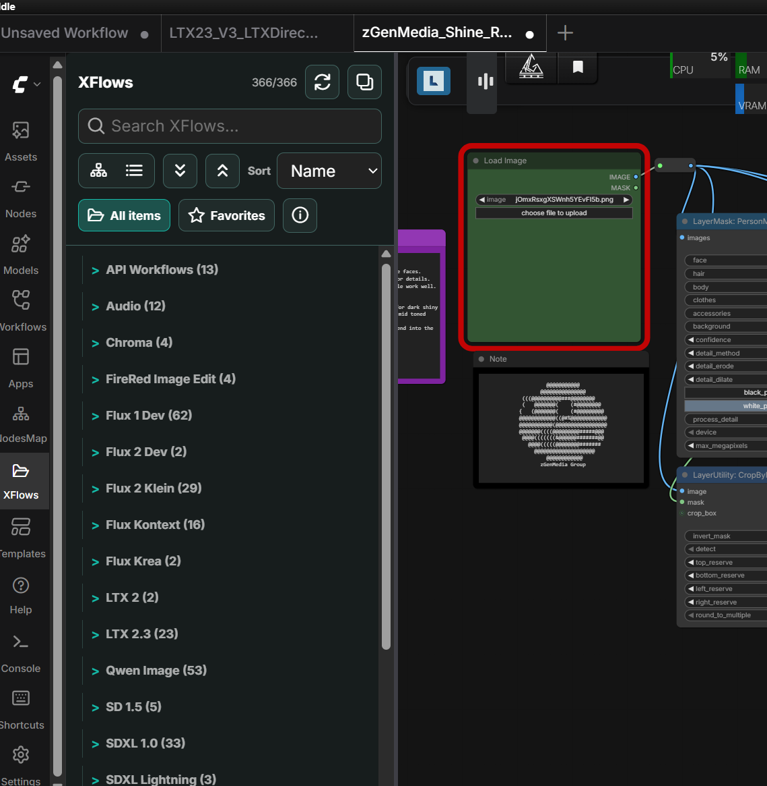

Core features:

- hierarchy and flat list views for workflow folders
- search across workflow name, folder path, tags, models, and node types
- sort by name, newest, most used, and last used
- favorites, run counts, and last-used tracking
- auto tags generated from parsed workflow JSON and local model references
- manual tag management, including hiding unwanted auto tags
- workflow move dialog with folder tree and new-folder creation
- soft delete, duplicate detection, sync, and import/export support

Workflow cards show the workflow name, folder breadcrumb, run count, node count, modified date, key tags, favorite state, and action buttons.

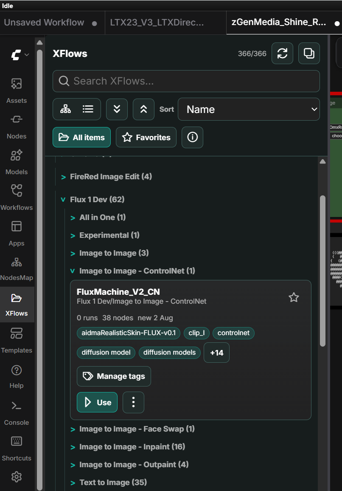

Use `Manage tags` to add custom tags or hide visible auto-generated tags without modifying the workflow JSON.

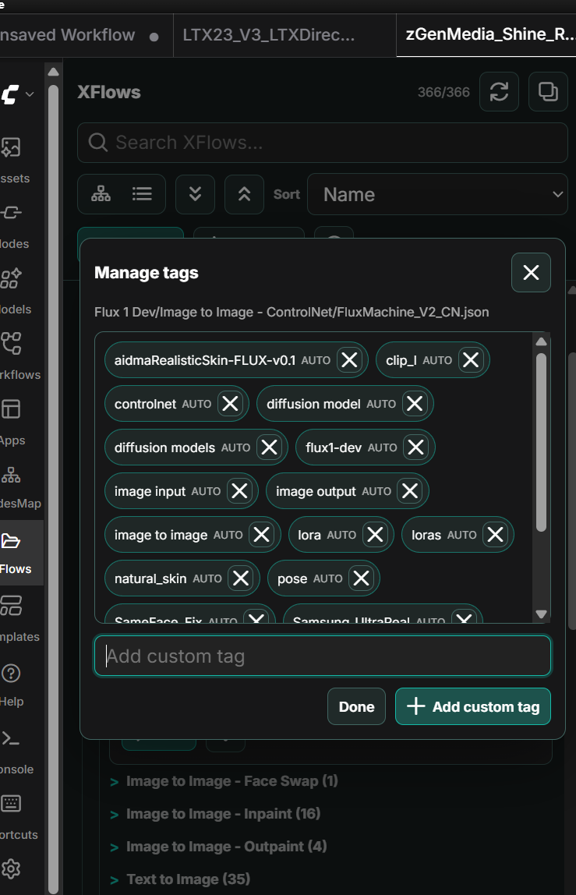

The move dialog keeps workflow organization inside the configured workflow root and avoids manual path entry.

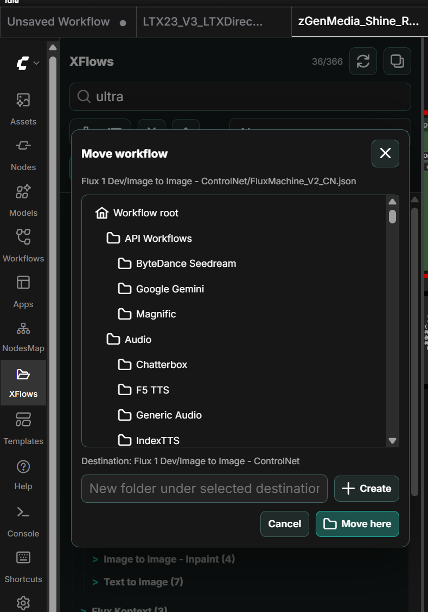

## XPrompts Prompt Library

`XPrompts` adds a compact side panel for saved prompts and quick-insert preset snippets. It is designed for prompt text you reuse often while building ComfyUI graphs.

Prompt entries include:

- title
- prompt text
- tags
- favorite state
- usage count
- created and updated timestamps

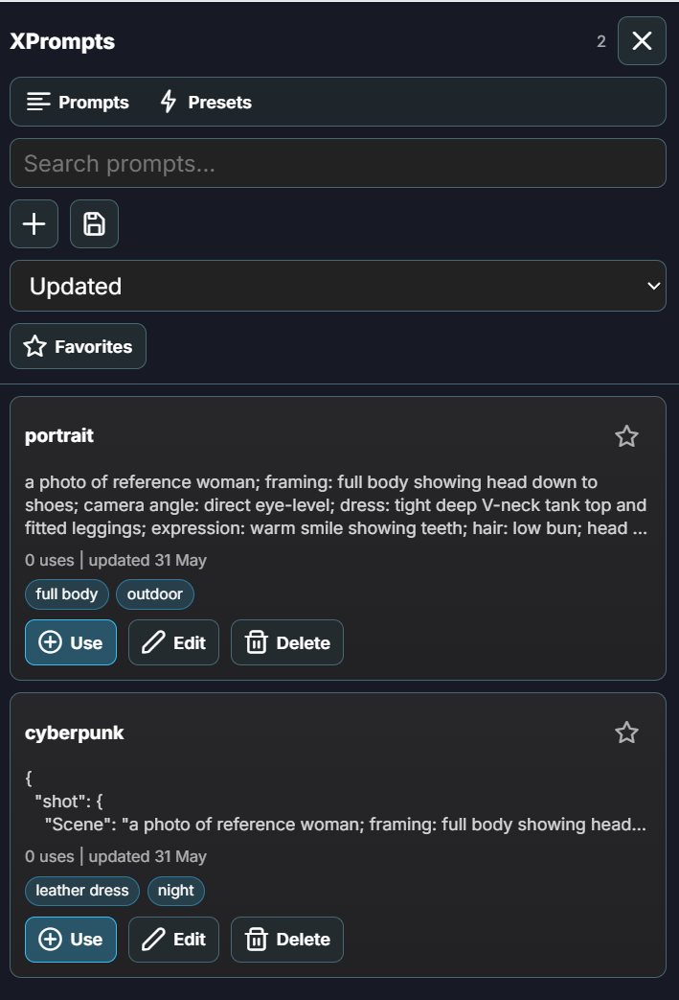

Prompt actions:

- `Use`: inserts the saved prompt into the active or last-focused ComfyUI text field
- `Edit`: updates the title, text, and tags
- `Delete`: removes the saved prompt
- `Save current selection`: saves selected text from the active ComfyUI text field as a new prompt

The `Presets` tab stores short snippets under one-level categories such as camera, lighting, scene, character, or environment. Presets have no titles; the snippet text is the reusable insert.

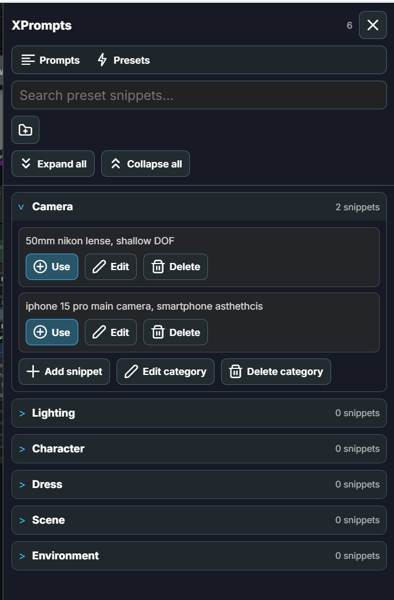

Preset categories can be expanded/collapsed, searched, edited, renamed, and deleted. Snippets can be added, edited, favorited, filtered, deleted, and inserted into the active text field.

## XNodes Node Snips

`XNodes` saves selected ComfyUI nodes for reuse in other workflows. One selected node is stored as a `node`; multiple selected nodes are stored as a `group`.

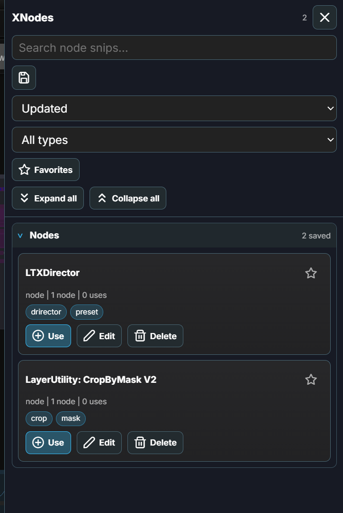

Node snips include:

- title
- type: `node` or `group`
- tags
- favorite state
- usage count
- serialized node data and widget values
- internal links between selected nodes for groups

Use `XNodes` when you have recurring loader chains, utility nodes, masks, routing patterns, or prompt helper groups that you want to paste into other workflows without rebuilding them.

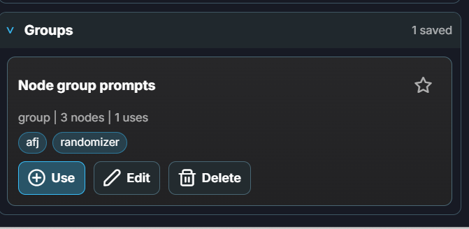

Groups preserve links between the selected nodes only. External graph connections are intentionally not restored.

## WorkflowX Settings, Import, and Export

WorkflowX settings are available under the `WorkflowX` settings category.

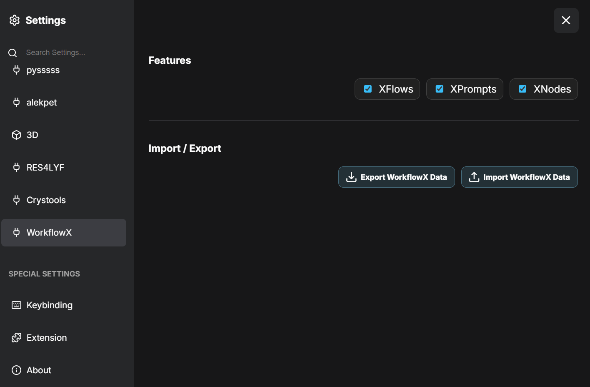

Settings include:

- `XFlows`: show or hide the workflow manager UI
- `XPrompts`: show or hide the prompt and preset panel
- `XNodes`: show or hide the node snippets panel
- `Export WorkflowX Data`: export workflows and WorkflowX metadata
- `Import WorkflowX Data`: restore workflows and WorkflowX metadata

Export lets you choose which parts to include:

- workflows as `workflowx_workflows.zip`
- XFlows metadata as `workflowx_xflows_metadata.json`
- XPrompts as `workflowx_xprompts.json`
- preset snippets as `workflowx_presets.json`
- XNodes as `workflowx_xnodes.json`
- an export manifest as `workflowx_manifest.json`

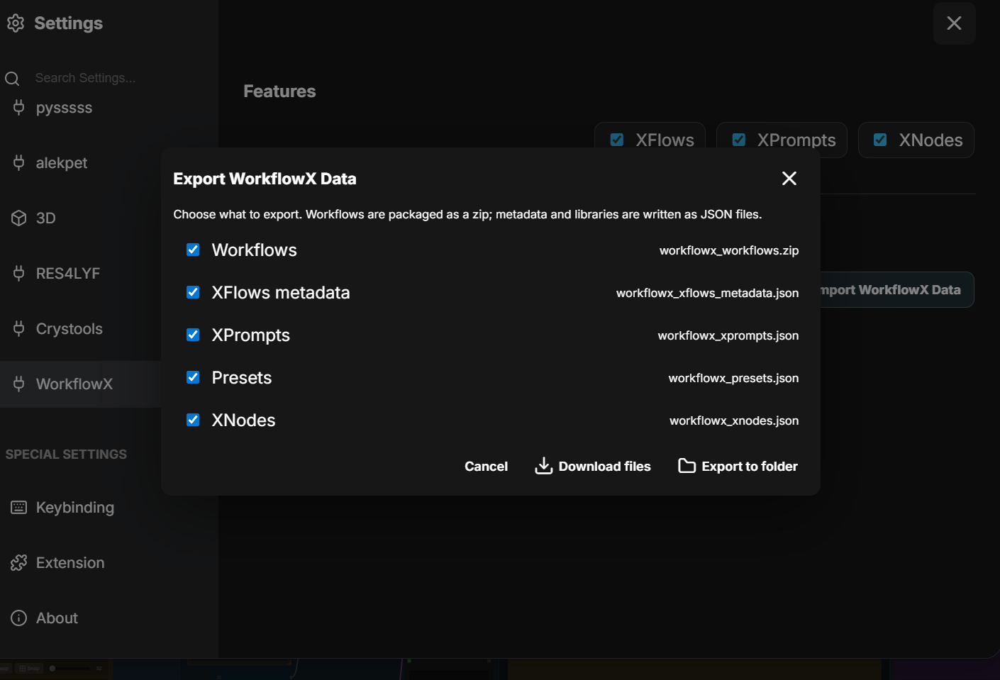

Import previews available files before restoring them. Selected imports overwrite the matching local stores, and WorkflowX creates a timestamped backup under `user/default/xflows_manager/import_backups` before replacing data.

## AFJ Visual JSON Tools

AFJ adds three prompt-building tools for users who prefer structured JSON prompts over one long text field:

- `AFJ - Visual Builder`: build and edit prompt JSON visually.
- `AFJ - Prompt Template Importer`: convert finished prompt JSON into a reusable AFJ template.
- `AFJ - Template Randomizer`: load a saved template and randomize selected fields at runtime.

AFJ is bundled inside WorkflowX, but its node names and saved template behavior remain compatible with the original AFJ pack.

### AFJ - Visual Builder

Use `AFJ - Visual Builder` when you want to compose a prompt as an organized tree. It is useful for detailed prompts where scene, subject, camera, lighting, pose, background, style, and negative prompts need to stay readable.

Quick start:

- Add the `AFJ - Visual Builder` node.
- Click `Open Visual Builder`.
- Build or edit the prompt tree.
- Click `Validate & Apply` to write the compiled JSON back into the node.

Important behavior:

- all fields are optional
- empty values are omitted from the output
- `Close` discards unsaved in-session edits
- `Validate & Apply` is the save boundary for the node's current editor state

### AFJ Templates

AFJ templates are reusable prompt trees saved as separate files under:

```text
visual_builder/templates/<template_name>.json
```

From the Visual Builder you can:

- save the current prompt tree as a template
- load a template explicitly without changing other templates
- delete templates you no longer need

Template names must be filesystem-safe. Empty names, names with invalid filename characters, reserved Windows names, and names ending in dot or space are rejected.

Template files do not store preset option lists. They store the prompt tree and randomizer selections, then refresh live options from the current `presets.json` when opened or used.

### AFJ - Prompt Template Importer

Use `AFJ - Prompt Template Importer` when you already have final prompt JSON from another source and want to turn it into an AFJ template.

Quick start:

- Add the `AFJ - Prompt Template Importer` node.
- Click `Open Prompt Template Importer UI`.
- Enter a template name.
- Paste a final prompt JSON object.
- Click `Convert/Preview`.
- Review the preview and report.
- Click `Save Template`.

The importer expects final prompt JSON, not an AFJ template file. If the JSON already looks like AFJ template metadata such as `tree` or `randomizer_checked`, the importer rejects it with a clear message.

During conversion, AFJ builds a minimal tree from the prompt JSON, binds matching paths to preset-backed fields, keeps unknown keys as custom fields/groups/arrays, and strips stored options so the template stays compatible with the live preset library.

### AFJ - Template Randomizer

Use `AFJ - Template Randomizer` when you want repeatable variation from saved templates.

Quick start:

- Add the `AFJ - Template Randomizer` node.
- Click `Open Template Randomizer UI`.
- Select a saved template.
- Choose which fields should randomize or override.
- Apply the selection to write `randomize_rules` back into the node.
- Run the graph.

The node outputs the generated `prompt_json` and a `run_log` showing which rule lines were processed. Preset randomization uses the current `presets.json`, so updated preset values can affect future runs without resaving every template.

### AFJ Prompting Guidance

The local AFJ guide recommends building prompts as deep, modular JSON instead of flattening many concepts into one string. Good AFJ prompts usually:

- keep the root as the prompt object itself
- separate scene, subject, pose, wardrobe, background, camera, lighting, style, and negative prompt details
- expand important concepts into child fields when the detail matters
- remove impossible details based on framing and visible context
- avoid process metadata inside prompt JSON

For the full AFJ walkthrough, see the bundled [`AFJ user guide`](docs/afj-awesome-flex-json/USER_GUIDE.md).

## Troubleshooting

### The node package imported, but nodes do not show

Hard refresh the browser after restarting ComfyUI. The Python package can import before the frontend menu cache updates.

### Group names or config names are stale

Use:

- `Refresh groups` on `Group Configurator`
- `Refresh configs` on `Config Selector`

Use these after adding, deleting, or renaming groups/configurator nodes.

### A Get node returns the wrong value

Check for:

- a global Set node with the same key outside groups
- duplicate active Set nodes with the same key and type
- a selector toggle still pointing at the old config
- a group name mismatch after renaming a group

### Duplicate key warnings

Warnings such as this mean more than one eligible Set node exists at the same priority:

```text
Multiple Set Int nodes found for key 'Steps'; using node id 123.
```

The result is deterministic, but the workflow is easier to maintain if each key/type appears once per active scope.

## Development

Run the dependency-free validation checks from this folder:

```powershell
python -m py_compile __init__.py nodes.py
@'
import tests.test_nodes as t
for name in sorted(dir(t)):
    if name.startswith('test_'):
        getattr(t, name)()
        print(f'{name}: ok')
'@ | python -
node --check web/js/key_config_tools.js
```

The tests cover typed lookup, selected config lookup, stale mode handling, global precedence, duplicate handling, and queue-time resolved values.

## Repository Notes

- GitHub repo: `WorkflowX-Configurator`
- ComfyUI category: `WorkflowX_Configurator`
- License: no license file included
