# WorkflowX for ComfyUI

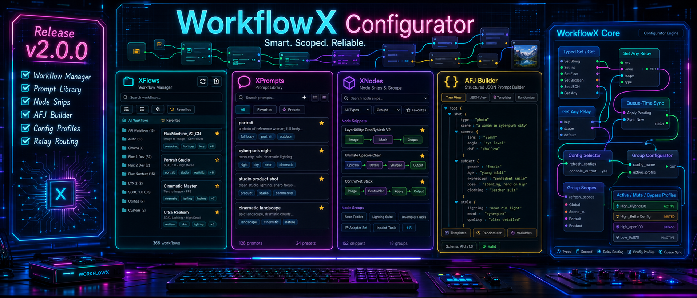

WorkflowX is a production toolkit for building, configuring, editing, organizing, and reusing ComfyUI workflows. It combines image and video nodes, model and LoRA controls, structured prompting, remote image APIs, reusable workflow libraries, scoped configuration, and canvas utilities in one package.

> **Short project brief:** WorkflowX adds 34 active ComfyUI nodes plus XFlows, XPrompts, XNodes, and package-wide right-click utilities. Use it to build configurable workflows, manage LoRA stacks and VRAM, load and edit images, create structured prompts, call supported image APIs, save video, store reusable graph fragments, group selections, and replace nodes without rebuilding compatible links.

## Capabilities

| Area | What WorkflowX adds | Jump to |
|---|---|---|
| Image input | Thumbnail browsing, masks, dimensions, advanced image-state controls | [Image and media loading](#image-and-media-loading) |
| Models | Ordered LoRA stacks and explicit model-component unloading | [Model and LoRA management](#model-and-lora-management) |
| Prompting | Multi-backend prompt composition and structured JsonX tools | [Prompting and JsonX](#prompting-and-jsonx) |
| APIs | Gemini/NanoBanana, Kie, and Atlas image generation/editing | [Remote image APIs](#remote-image-apis) |
| Image tools | Interactive compare/edit, deterministic processing, crop/stitch swap bridge | [Image editing, processing, and swapping](#image-editing-processing-and-swapping) |
| Output | H.264, H.265, and AV1 video encoding with optional audio | [Video output](#video-output) |
| Configuration | Config SelectorX, typed Set/Get values, and wildcard relay routing | [Workflow configuration and routing](#workflow-configuration-and-routing) |
| Libraries | XFlows, XPrompts, and XNodes sidebar libraries | [Workflow libraries](#workflow-libraries) |
| Canvas | Native grouping and compatible node replacement from every node menu | [Canvas right-click utilities](#canvas-right-click-utilities) |

## Installation and settings

1. Place this repository in `ComfyUI/custom_nodes/WorkflowX-Configurator`.
2. Install optional dependencies required by the features you use.
3. Restart ComfyUI and refresh the browser.
4. Confirm **WorkflowX** appears in the node menu and **XFlows**, **XPrompts**, and **XNodes** appear in the interface.

WorkflowX settings let you enable or disable XFlows, XPrompts, and XNodes and export or import their local library data. Keep credentials and machine-specific paths out of workflows intended for sharing.

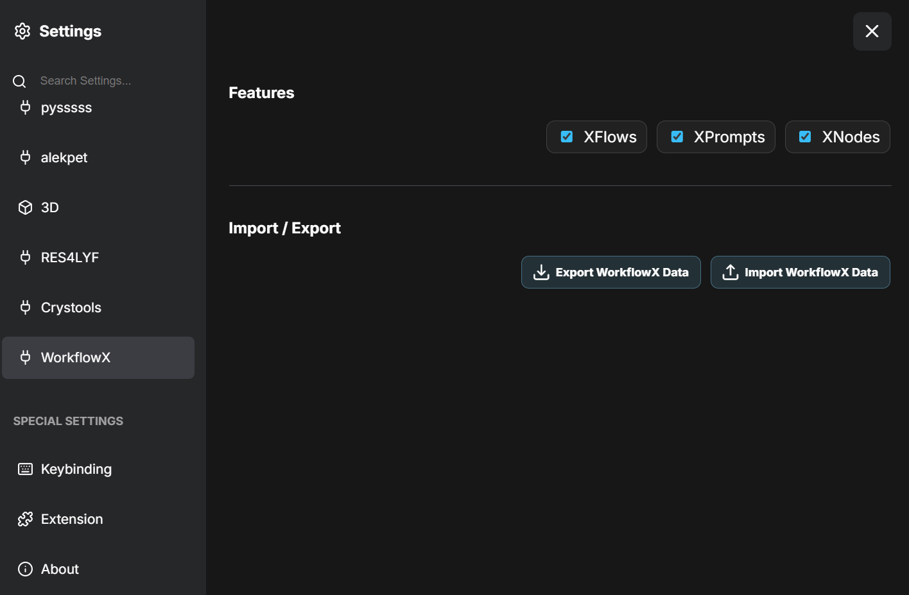

All downloadable examples are under [`examples/`](examples/README.md). They contain no bundled media, credentials, personal paths, prompts, or model-library names. Replace the neutral resource placeholders after loading.

## Image and media loading

WorkflowX provides a quick image picker and an advanced loader for workflows that also need mask polarity, source dimensions, or serialized image-editor state.

### Load ImageX

**Node ID / category:** `WorkflowX_LoadImageX` · `WorkflowX/Image Loader`

| Inputs and widgets | Type | Required | Behavior |
|---|---|---:|---|
| `image` | image-file combo | Yes | Selects an image from ComfyUI's input directory. |
| Upload and **Browse Thumbnails** controls | UI | — | Uploads a file or opens the searchable thumbnail browser. |

| Outputs | Type | Behavior |
|---|---|---|
| `image` | `IMAGE` | Loaded RGB image batch. |
| `mask` | `MASK` | Alpha-derived mask, or a default empty mask when no alpha is present. |

The backend validates the selected path against ComfyUI's input directory and participates in normal image-file change detection.

### Load ImageX Adv

**Node ID / category:** `WorkflowX_LoadImageXAdv` · `WorkflowX/Image Loader`

| Inputs and state | Type | Required | Behavior |
|---|---|---:|---|
| `image` | image-file combo | Yes | Selects the source image. |
| `workflowx_state` | `STRING` | UI-managed | Serialized advanced resize, crop, mask, and display state. |
| Picker/editor buttons | UI | — | Open thumbnail browsing and advanced image controls. |

| Outputs | Type | Behavior |
|---|---|---|
| `image` | `IMAGE` | Processed image. |
| `mask` | `MASK` | Effective mask. |
| `inverted_mask` | `MASK` | Inverse of the effective mask. |
| `width` | `INT` | Result width. |
| `height` | `INT` | Result height. |

The serialized state travels with the workflow; source files do not. See the [advanced loader guide](docs/IMAGE_LOADERS.md).

### Working example

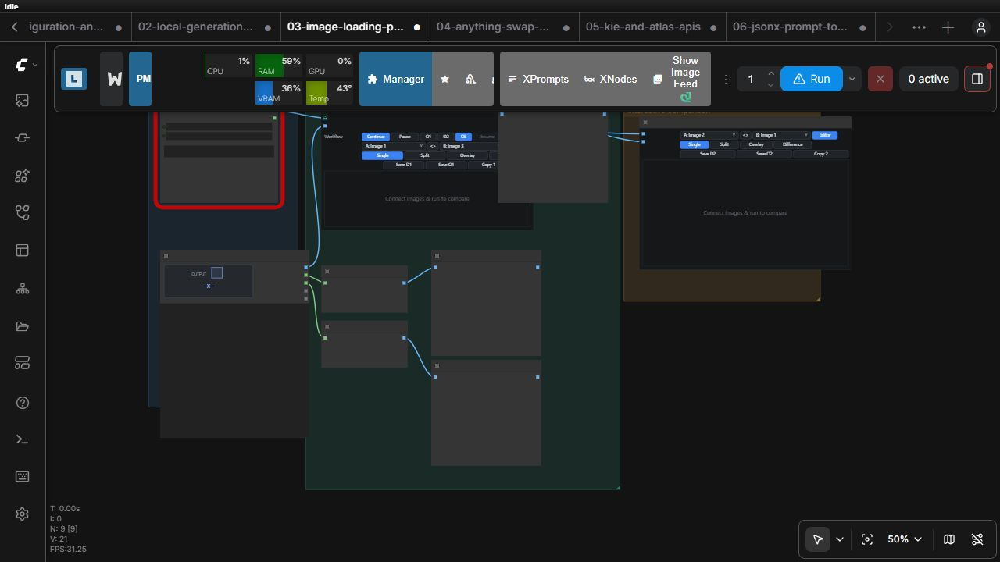

[Download: image loading, processing, and comparison](examples/03-image-loading-processing-and-comparison.json) — select two local images, then inspect the image, mask, inverted mask, processed output, and terminal comparison.

## Model and LoRA management

Load Diffusion Model X keeps preferred diffusion models visible on the canvas and switches between them with a single active selection. LoraX applies a visible, ordered LoRA stack. Unload Models By Type adds an execution dependency for releasing selected model components after the graph stage you choose.

### Load Diffusion Model X

**Node ID / category:** `KVGC_LoadDiffusionModelX` · `WorkflowX/Loaders`

| Inputs | Type | Required | Behavior |
|---|---|---:|---|
| `weight_dtype` | combo | Yes | Uses the choices and behavior exposed by ComfyUI's native Load Diffusion Model node. |
| Diffusion-model rows | UI-managed | Yes | Stores multiple preferred model filenames; exactly one row is active. |

| Outputs | Type | Behavior |
|---|---|---|
| `MODEL` | `MODEL` | The active row loaded through ComfyUI's native `UNETLoader`. |

**Controls:** add, replace, remove, search, refresh, inspect model details, and switch the active model with radio-style toggles. The picker uses LoRA Manager metadata and previews when available, while remaining fully usable from ComfyUI's diffusion-model folders alone. The shared `weight_dtype` control applies to whichever row is active. [Load Diffusion Model X guide](docs/LOAD_DIFFUSION_MODEL_X.md)

### LoraX

**Node ID / category:** `KVGC_LoraX` · `WorkflowX/Loaders`

| Inputs | Type | Required | Behavior |
|---|---|---:|---|
| `model` | `MODEL` | Yes | Base diffusion model. |
| `clip` | `CLIP` | No | Optional text encoder to receive LoRA patches. |
| LoRA rows | UI-managed | No | Searchable LoRA selection plus model/CLIP strengths. |

| Outputs | Type | Behavior |
|---|---|---|
| `MODEL` | `MODEL` | Model with enabled LoRAs applied in displayed order. |
| `CLIP` | `CLIP` | Patched CLIP when supplied. |
| `trigger_words` | `STRING` | Trigger words gathered from enabled rows. |
| `loaded_loras` | `STRING` | Human-readable audit of the applied stack. |

**Controls:** add, remove, reorder, search/select, enable/disable, and refresh LoRA rows. Empty rows are skipped; unavailable filenames are reported instead of silently substituted. [LoraX guide](docs/LORAX.md)

### Unload Models By Type

**Node ID / category:** `KVGC_UnloadModelsByType` · `WorkflowX/VRAM`

| Inputs | Type | Required | Behavior |
|---|---|---:|---|
| `model_type` | combo | Yes | Text Encoder, Diffusion Model / UNet, VAE, CLIP Vision, Other, or All loaded models. |
| `device_scope` | combo | Yes | Current device or all devices. |
| `empty_cache` | `BOOLEAN` | Yes | Requests device-cache cleanup after unloading. |
| `trigger` | wildcard | No | Establishes when unloading runs. |
| `model`, `clip`, `vae`, `conditioning` | matching types | No | Optional typed passthrough values. |

| Outputs | Type | Behavior |
|---|---|---|
| `trigger` | wildcard | Preserves the execution dependency. |
| `model`, `clip`, `vae`, `conditioning` | matching types | Typed passthroughs. |
| `status` | `STRING` | Reports what was requested and released. |

### Working example

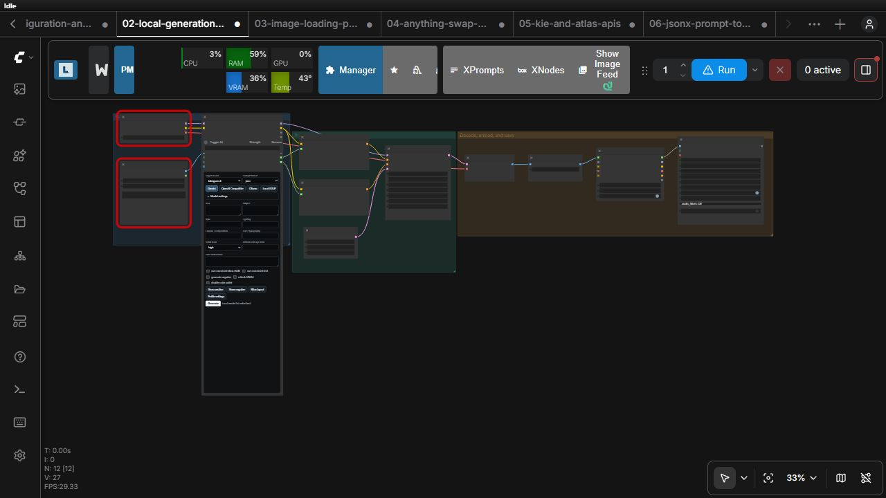

[Download: local generation and model management](examples/02-local-generation-and-model-management.json) — Load Diffusion Model X selects the active model, Load ImageX guides Unified Autoprompter X, LoraX participates in sampling, and the generated batch triggers model unloading before Save Video X.

## Prompting and JsonX

WorkflowX supports natural or structured prompting from images and text, then provides a connected JsonX toolchain for generating, inspecting, importing, and randomizing structured prompt documents.

### Unified Autoprompter X

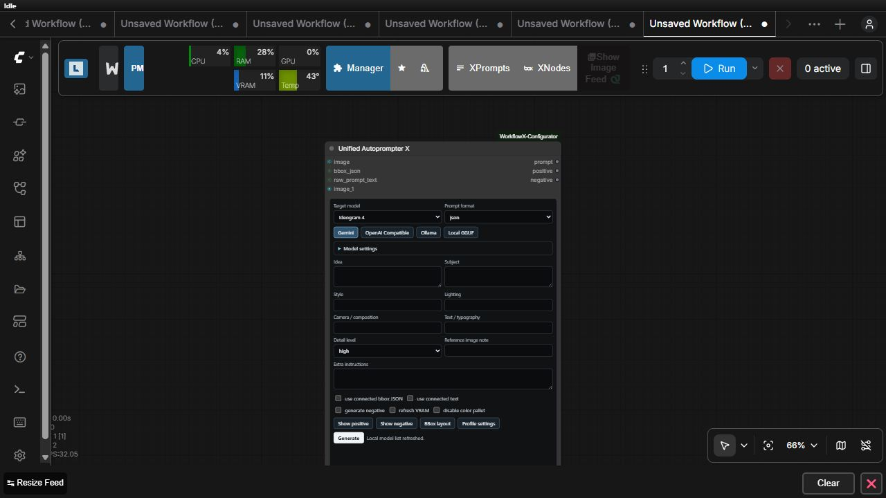

**Node ID / category:** `UnifiedAutoprompterX` · `WorkflowX/Prompting`

| Inputs and widgets | Type | Required | Behavior |
|---|---|---:|---|
| `target_model`, `prompt_format` | combo | Yes | Select target-model conventions and natural, tag, or JSON formatting. |
| `negative_enabled`, `enable_bbox_json_input`, `enable_text_input` | `BOOLEAN` | Yes | Enable optional prompt channels. |
| `refresh_vram`, `disable_color_palette` | `BOOLEAN` | Yes | Control model refresh and palette output. |
| `generated_positive`, `generated_negative`, `final_prompt` | `STRING` | UI-managed | Stores generated and user-edited prompt text. |
| `image`, dynamic `image_N` | `IMAGE` | No | Visual references. |
| `bbox_json`, `raw_prompt_text` | `STRING` | No | Structured layout or source text. |
| `ui_state` | `STRING` | UI-managed | Serialized frontend composition state. |

| Outputs | Type | Behavior |
|---|---|---|
| `prompt` | `STRING` | Final selected-format prompt. |
| `positive` | `STRING` | Positive prompt channel. |
| `negative` | `STRING` | Negative prompt channel when enabled. |

**Controls:** generate, reset, refresh VRAM, target/profile controls, video fields, bounding-box tools, and backend settings. See the [complete Autoprompter guide](docs/UNIFIED_AUTOPROMPTER_X.md).

### LLM to JsonX

**Node ID / category:** `LLMToJsonX` · `WorkflowX/Prompting/JsonX`

| Inputs and state | Type | Required | Behavior |
|---|---|---:|---|
| `user_instructions` | `STRING` | Yes | Generation instruction. |
| `generation_mode` | combo | Yes | Fast or refined generation. |
| `preset_context_mode` | combo | Yes | Optimized or full preset context. |
| `generated_prompt_json` | `STRING` | UI-managed | Stored generated result. |
| `image` | `IMAGE` | No | Optional visual context. |
| `enable_framing_and_placement`, `output_format`, `generation_profile`, `template_use_presets`, `detail_level` | widgets | No | Profile-dependent generation controls. |
| `ui_state` | `STRING` | UI-managed | Serialized frontend state. |

| Outputs | Type | Behavior |
|---|---|---|
| `prompt` | `STRING` | Validated JSON or natural prompt, according to `output_format`. |

### JsonX visual and template tools

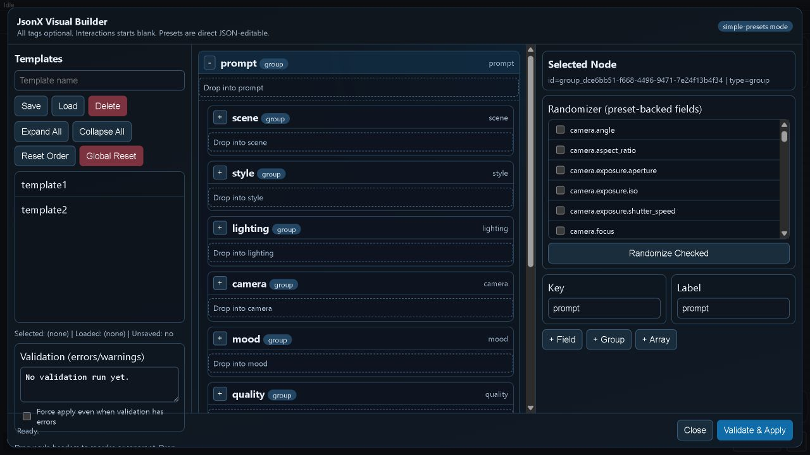

| Node | Internal ID | Inputs | Outputs | Principal controls |
|---|---|---|---|---|
| JsonX - Visual Builder | `FluxVisualJsonBuilder` | Optional `prompt_json` (`STRING`) | `prompt_json` (`STRING`) | Open builder, schema fields, presets, apply, reset |
| JsonX - Prompt Template Importer | `AFJPromptTemplateImporter` | Optional `template_name`, `source_prompt_json`, `import_report` (`STRING`) | `template_payload_json` (`STRING`) | Open importer, analyze/import, apply, clear |
| JsonX - Template Randomizer | `FluxTemplateRandomizer` | Optional `template_name`, `randomize_rules`, `randomize_rules_help` (`STRING`), `seed` (`INT`) | `prompt_json`, `run_log` (`STRING`) | Template picker, rule editor, seeded randomization |

The builder normalizes JSON before output; the importer reports accepted and skipped fields; the randomizer applies reproducible field choices and emits an audit log. See the [JsonX user guide](docs/afj-awesome-flex-json/USER_GUIDE.md).

### Working example

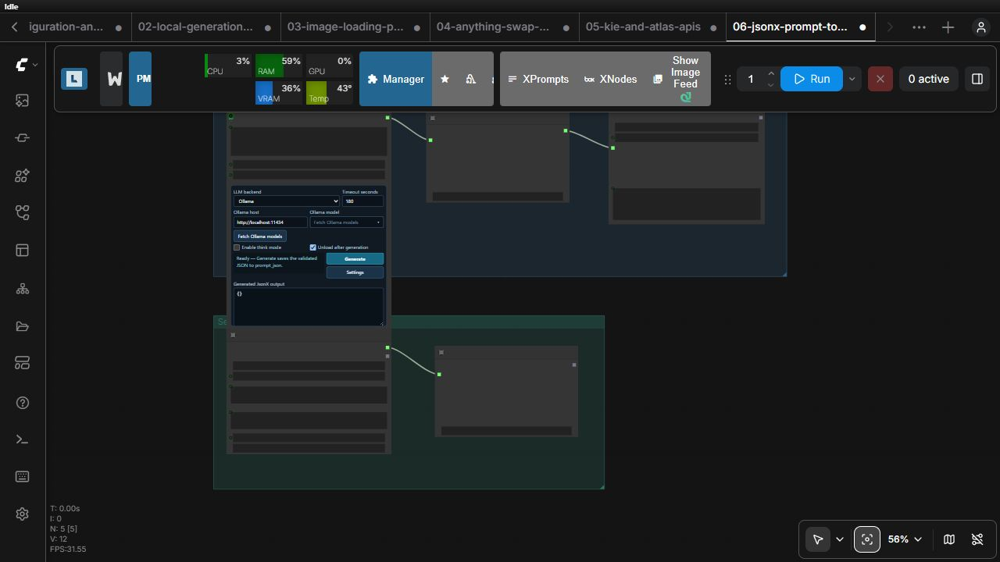

[Download: JsonX prompt toolchain](examples/06-jsonx-prompt-toolchain.json) — the first lane connects LLM to JsonX → Visual Builder → Template Importer; the second connects Template Randomizer → a second builder for inspection.

## Remote image APIs

API nodes are deliberately credential-free in shared workflows. Their outputs use ordinary `IMAGE` sockets, so remote generation can feed the same preview, processing, and save nodes as local generation.

### NanoBanana Full API

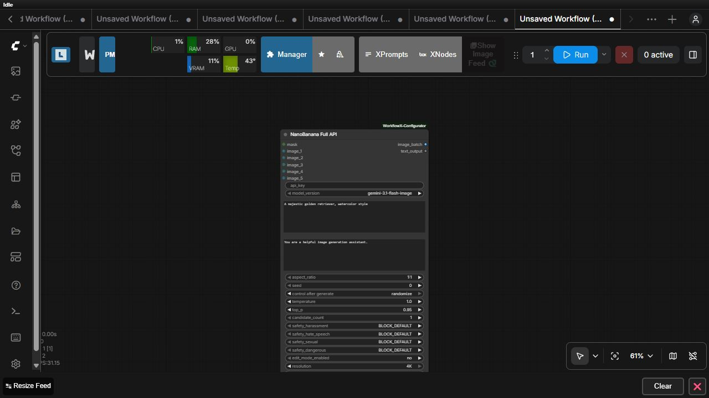

**Node ID / category:** `NanoBanana_Gemini_2_5_Flash_V2` · `WorkflowX/API`

| Input group | Exact inputs | Type / behavior |
|---|---|---|
| Authentication and model | `api_key`, `model_version` | Private string and supported Gemini image-model combo. |
| Prompting | `prompt`, `system_prompt` | Generation/edit instructions. |
| Sampling and output | `aspect_ratio`, `seed`, `temperature`, `top_p`, `candidate_count`, `resolution`, `timeout_seconds` | Request and output controls. |
| Safety | `safety_harassment`, `safety_hate_speech`, `safety_sexual`, `safety_dangerous` | Per-category blocking policy. |
| Editing/thinking | `edit_mode_enabled`, `show_thoughts`, `thinking_level` | Edit and reasoning controls. |
| Optional media | `mask`, `image_1` … `image_5` | Mask and reference images. |

| Outputs | Type | Behavior |
|---|---|---|
| `image_batch` | `IMAGE` | Returned candidate images. |
| `text_output` | `STRING` | Provider text or response details. |

Empty credentials, provider errors, timeouts, and safety failures are surfaced. See the [NanoBanana API guide](docs/NANOBANANA_FULL_API.md).

### Kie and Atlas Image API X

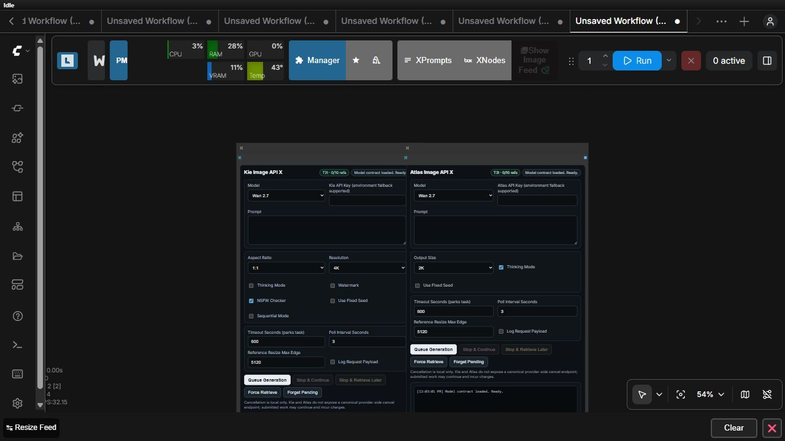

**Node IDs / category:** `WorkflowX_KieImageAPI`, `WorkflowX_AtlasImageAPI` · `WorkflowX/API`

| Input group | Exact shared inputs | Type / behavior |
|---|---|---|
| Request | `api_key`, `model`, `prompt`, `aspect_ratio`, `image_size` | Provider credential, model, prompt, and dimensions. |
| Polling | `timeout_seconds`, `poll_interval_seconds`, `retrieval_mode` | Submit/poll or force-retrieve behavior. |
| Quality | `quality`, `guidance_scale`, `num_inference_steps`, `media_resolution`, `input_fidelity`, `enable_pro` | Provider/model-aware quality controls. |
| Safety and provenance | `nsfw_checker`, `enable_safety_checker`, `watermark`, `show_payload` | Safety, watermark, and payload visibility. |
| Generation options | `thinking_mode`, `seed_enabled`, `seed`, `enable_sequential`, `output_format`, `enable_web_search`, `enable_image_search` | Optional provider features. |
| Custom dimensions | `custom_size_enabled`, `custom_size_auto`, `custom_width`, `custom_height`, `reference_max_edge` | Custom output/reference sizing. |
| References | Dynamic `image_1` … `image_14` | Frontend adds image sockets as references are connected. |

| Node | Outputs | Provider-specific behavior |
|---|---|---|
| `WorkflowX_KieImageAPI` | `image` (`IMAGE`) | Kie submission, polling, pending-task, and retrieval path. |
| `WorkflowX_AtlasImageAPI` | `image` (`IMAGE`) | Atlas submission and retrieval path with its supported model/size catalog. |

The frontend changes visible controls according to the selected model. Pending records allow later force retrieval. See the [Kie and Atlas guide](docs/KIE_ATLAS_API_NODES.md).

### Working examples

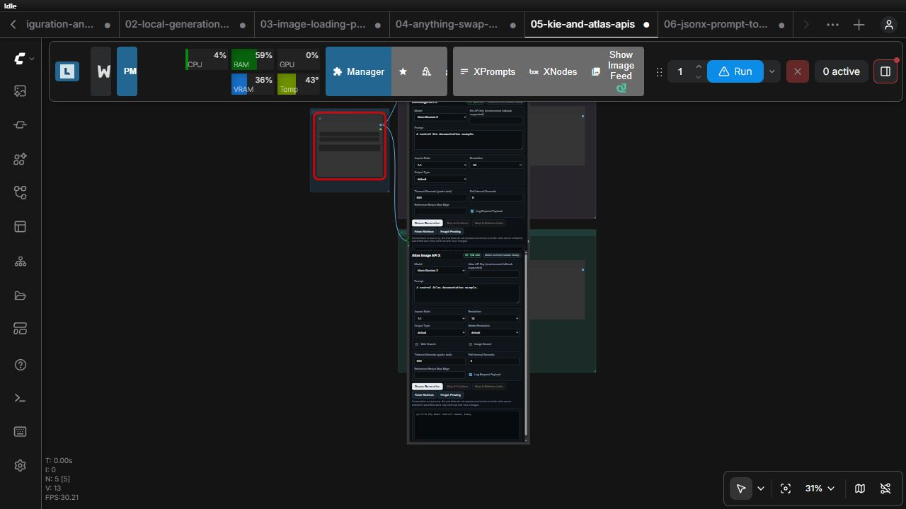

- [Anything Swap with NanoBanana](examples/04-anything-swap-with-nanobanana.json) connects a cropped region, crop mask, and swap prompt to the API before stitching the returned image.
- [Kie and Atlas APIs](examples/05-kie-and-atlas-apis.json) uses separate provider branches with an optional shared reference image and output previews.

## Image editing, processing, and swapping

### Image ProcessorX

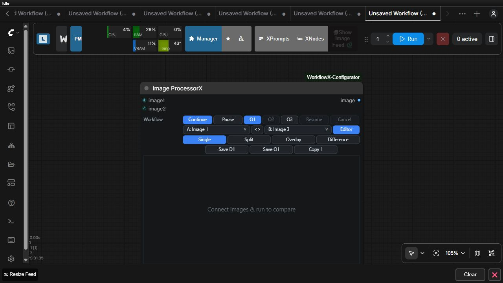

**Node ID / category:** `WorkflowX_ImageProcessorX` · `WorkflowX/Image Compare`

| Inputs and state | Type | Required | Behavior |
|---|---|---:|---|
| `image1` | `IMAGE` | Yes | Primary image. |
| `image2` | `IMAGE` | No | Optional second layer/image. |
| `operation_mode` | Continue / Pause | Yes | Executes immediately or pauses for interactive editing. |
| `output_image` | O1 / O2 / O3 | Yes | Selects source one, source two, or composed output. |
| `processor_state` | `STRING` | UI-managed | Versioned, normalized edit recipe. |

| Outputs | Type | Behavior |
|---|---|---|
| `image` | `IMAGE` | Selected or composed result. |

**Controls:** open editor, apply/continue, reset, layer order, opacity, adjustments, curves, presets, and save/session actions. State is validated server-side so a reloaded workflow renders deterministically. [Image ProcessorX guide](docs/IMAGE_PROCESSOR_X.md)

### Image Compare Edit X

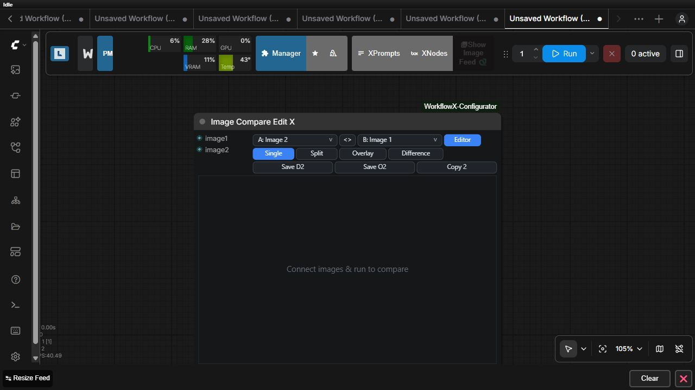

**Node ID / category:** `KVGC_ImageCompareEditX` · `WorkflowX/Image Compare`

| Inputs | Type | Required | Behavior |
|---|---|---:|---|
| `image1` | `IMAGE` | Yes | First comparison image. |
| `image2` | `IMAGE` | Yes | Second comparison image. |

| Outputs | Type | Behavior |
|---|---|---|
| None | — | Terminal interactive output node; browser-side edits do not emit a downstream tensor. |

**Controls:** comparison divider, preview navigation, layers, masks, blend mask, brush, adjustments, curves, reset, copy, and save. [Editor guide](docs/IMAGE_COMPARE_EDIT_X_EDITOR.md)

### Anything Swap bridge

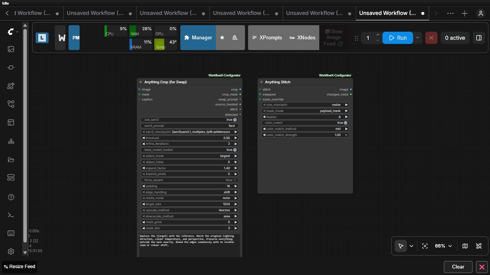

#### Anything Crop For Swap

**Node ID / category:** `AnythingCropForSwap` · `WorkflowX/Anything Swap`

| Input group | Exact inputs | Behavior |
|---|---|---|
| Source | `image`; optional `mask`, `caption` | Source image plus optional precomputed mask/caption. |
| Detection | `use_sam3`, `sam3_prompt`, `sam3_checkpoint`, `threshold`, `refine_iterations`, `keep_model_loaded`, `select_mode`, `object_index` | Optional SAM3 object selection. |
| Geometry | `expand_factor`, `expand_pixels`, `force_square`, `padding`, `edge_handling`, `resize_mode`, `target_size`, `upscale_method`, `downscale_method` | Crop and resize policy. |
| Mask/prompt | `mask_grow`, `mask_blur`, `swap_prompt` | Final crop mask and downstream edit instruction. |

| Outputs | Type | Behavior |
|---|---|---|
| `crop` | `IMAGE` | Selected crop. |
| `crop_mask` | `MASK` | Crop-space mask. |
| `swap_prompt` | `STRING` | Prompt passthrough. |
| `source_masked` | `IMAGE` | Source with selected region visualized/masked. |
| `stitch` | `SWAP_STITCH` | Geometry payload consumed by Anything Stitch. |
| `detected` | `BOOLEAN` | Whether a usable region was found. |

#### Anything Stitch

**Node ID / category:** `AnythingStitch` · `WorkflowX/Anything Swap`

| Inputs | Type | Required | Behavior |
|---|---|---:|---|
| `stitch` | `SWAP_STITCH` | Yes | Crop geometry from Anything Crop. |
| `swapped` | `IMAGE` | Yes | Edited/replaced crop. |
| `mask_override` | `MASK` | No | Optional replacement mask. |
| `size_mismatch`, `mask_mode`, `feather`, `color_match`, `color_match_method`, `color_match_strength` | widgets | Yes | Resize, mask, feather, and color-matching policy. |

| Outputs | Type | Behavior |
|---|---|---|
| `image` | `IMAGE` | Stitched full image. |
| `changed_mask` | `MASK` | Effective changed region. |

See the [Anything Swap guide](docs/ANYTHING_SWAP_BRIDGE.md).

### Working examples

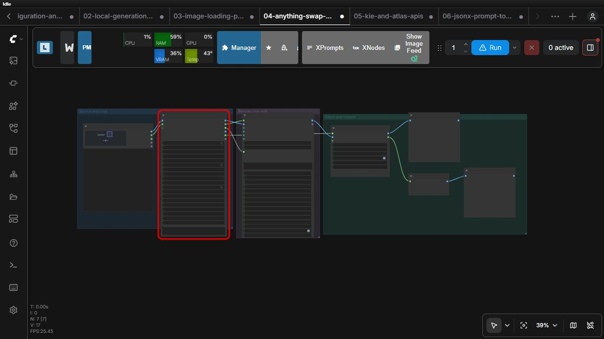

- [Image loading, processing, and comparison](examples/03-image-loading-processing-and-comparison.json)
- [Anything Swap with NanoBanana](examples/04-anything-swap-with-nanobanana.json)

## Video output

### Save Video X

**Node ID / category:** `WorkflowX_SaveVideoX` · `WorkflowX/Video`

| Inputs | Type | Required | Behavior |
|---|---|---:|---|
| `images` | `IMAGE` | Yes | Image batch encoded as frames. |
| `audio` | `AUDIO` | No | Optional audio stream. |
| `vae` | `VAE` | No | Optional compatibility input. |
| `frame_rate`, `filename_prefix`, `format` | widgets | Yes | Timing, relative output prefix, and H.264/H.265/AV1 container. |
| `crf_quality`, `pixel_format`, `color_range` | widgets | Yes | Codec quality and pixel/color policy. |
| `save_metadata_preview_image`, `audio_bitrate`, `audio_filters`, `save_output` | widgets | Yes | Metadata preview, audio encoding, filters, and preview/output destination. |

| Outputs | Type | Behavior |
|---|---|---|
| `Filenames` | `VHS_FILENAMES` | Encoded file descriptors compatible with video-preview consumers. |

Frame shape, codec settings, and FFmpeg availability are validated at execution. [Save Video X guide](docs/SAVE_VIDEO_X.md)

### Working example

The [local generation and model management workflow](examples/02-local-generation-and-model-management.json) turns a generated batch into video and uses the batch as the trigger for model unloading before encoding.

## Workflow configuration and routing

Config SelectorX is WorkflowX's integrated configuration system. Its **Scopes** and **Configs** buttons manage native ComfyUI groups directly; the previous separate configurator nodes are not part of current workflows.

### Config SelectorX

**Node ID / category:** `KVGC_ConfigSelectorX` · `WorkflowX/Workflow Config`

| Inputs and state | Type | Required | Behavior |
|---|---|---:|---|
| `selected_config` | `STRING` | Yes | Active named configuration. |
| `console_output` | no / yes | Yes | Enables resolution diagnostics. |
| `selectorx_state` | `STRING` | UI-managed | Versioned scopes, configurations, group modes, mute state, and bypass state. |

| Outputs | Type | Behavior |
|---|---|---|
| None | — | Configuration controller; it changes scoped node participation and Get resolution. |

**Controls:** **Scopes** assigns each native group to configuration, selector-mute, selector-bypass, or ignore behavior. **Configs** creates named configurations and assigns Active, Bypass, Mute, or Ignore per controlled group. State is stored in workflow JSON and validated during execution. [Config SelectorX guide](docs/CONFIG_SELECTOR_X.md)

### Typed Set/Get values

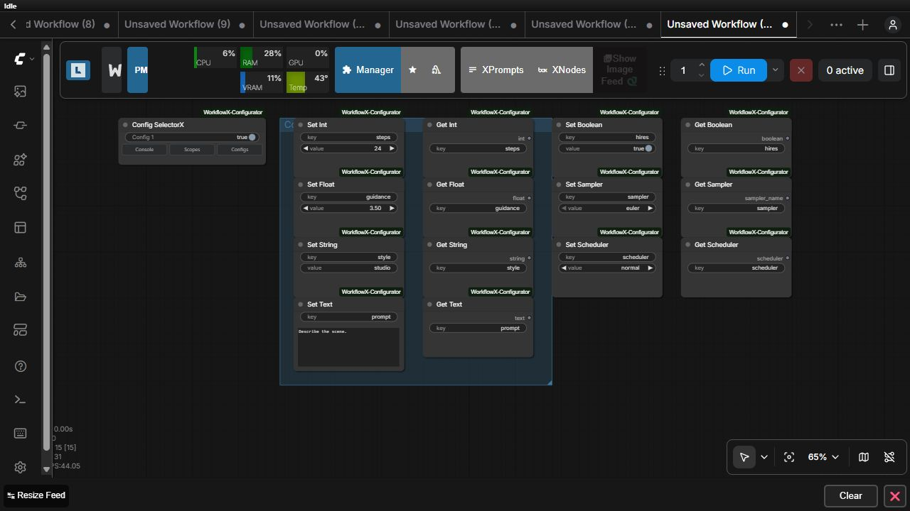

Set nodes publish a keyed value from their scoped group and intentionally have no output. Get nodes resolve the selected candidate and expose it to the execution graph. `resolved_value`, `resolved_config`, and `resolved_digest` are visible but UI-managed provenance fields on every typed Get node.

| Pair | Internal IDs | Set contract | Get output |
|---|---|---|---|
| Integer | `KVGC_SetInt`, `KVGC_GetInt` | `key: STRING`, `value: INT`; no outputs | `int: INT` |
| Float | `KVGC_SetFloat`, `KVGC_GetFloat` | `key: STRING`, `value: FLOAT`; no outputs | `float: FLOAT` |
| String | `KVGC_SetString`, `KVGC_GetString` | `key: STRING`, `value: STRING`; no outputs | `string: STRING` |
| Multiline text | `KVGC_SetText`, `KVGC_GetText` | `key: STRING`, `value: STRING`; no outputs | `text: STRING` |
| Boolean | `KVGC_SetBoolean`, `KVGC_GetBoolean` | `key: STRING`, `value: BOOLEAN`; no outputs | `boolean: BOOLEAN` |
| Sampler | `KVGC_SetSampler`, `KVGC_GetSampler` | `key: STRING`, sampler combo `value`; no outputs | `sampler_name`: live ComfyUI sampler combo |
| Scheduler | `KVGC_SetScheduler`, `KVGC_GetScheduler` | `key: STRING`, scheduler combo `value`; no outputs | `scheduler`: live ComfyUI scheduler combo |

Sampler and scheduler values are validated against the running ComfyUI installation. Typed resolution follows native group containment and the selected Config SelectorX state.

### Relay routing

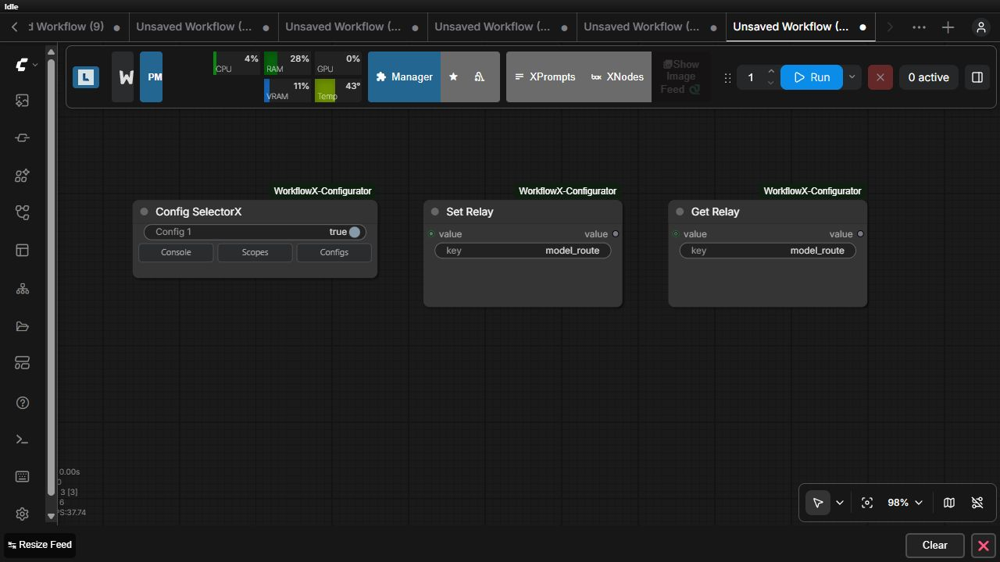

| Node | Internal ID | Inputs | Outputs | Behavior |
|---|---|---|---|---|
| Set Relay | `KVGC_SetRelay` | `value` (wildcard), `key` (`STRING`) | `value` (wildcard passthrough) | Publishes a scoped object while optionally keeping it on the local execution path. |
| Get Relay | `KVGC_GetRelay` | `key` (`STRING`), optional fallback `value` (wildcard) | `value` (wildcard) | Resolves the selected routed object or returns the connected fallback. |

### Working example

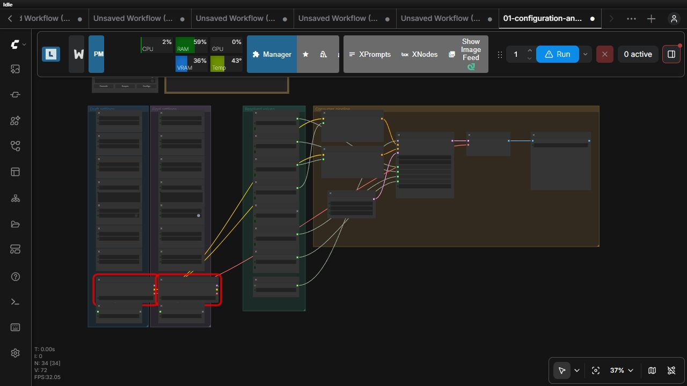

[Download: configuration and routing](examples/01-configuration-and-routing.json) — Draft and Final native groups provide typed values and alternative model relays; resolved values drive real sampler and text-encoding inputs.

The larger [advanced configured production workflow](examples/07-advanced-configured-production.json) shows the same relay pattern inside a model → LoRA → sampler → cleanup → video pipeline.

## Workflow libraries

These are sidebar features rather than executable nodes, so they are demonstrated as interface workflows instead of artificial JSON nodes.

### XFlows

XFlows organizes ComfyUI workflows with folders, list/card views, tags, favorites, search, move tools, duplicate detection, and trash handling without changing the workflow JSON format.

[XFlows guide](docs/XFLOWS.md)

### XPrompts

XPrompts stores searchable prompts and reusable preset blocks for insertion and editing. It complements structured JsonX workflows without forcing prompt text into a workflow graph.

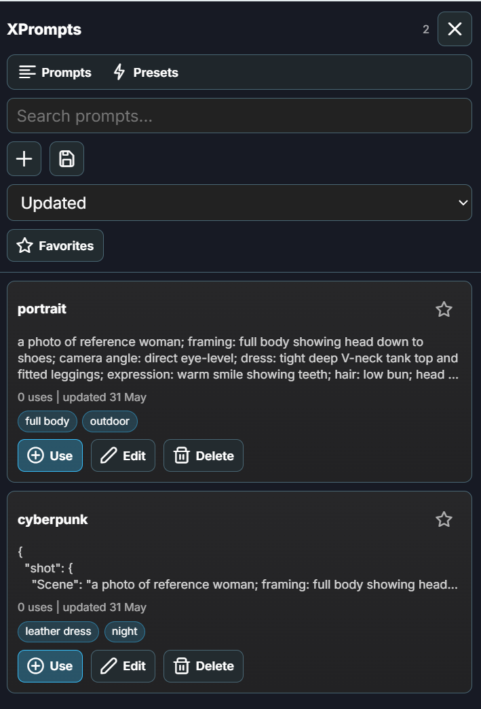

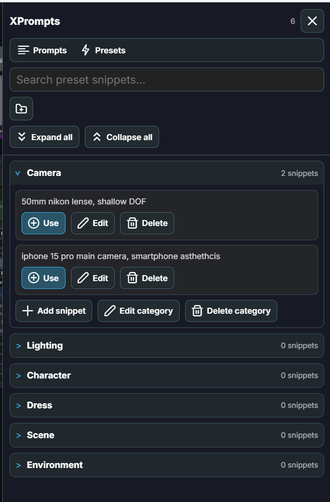

[XPrompts guide](docs/XPROMPTS.md)

### XNodes

XNodes saves reusable nodes, selections, and native groups. Group snippets preserve selected ComfyUI groups, group geometry and styling, contained nodes, widget values, and links whose endpoints are both inside the saved selection.

[XNodes guide](docs/XNODES.md)

## Canvas right-click utilities

WorkflowX adds two options to every registered node's context menu.

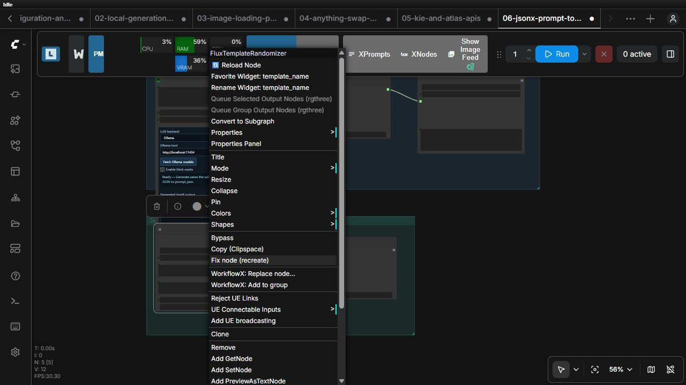

### WorkflowX: Add to group

- If the clicked node is part of the current selection, all selected nodes are placed in one native ComfyUI group.
- If the clicked node is not selected, only that node is grouped.
- Group bounds use ComfyUI's **Group Selected Nodes Padding** setting, with a safe default when the setting is unavailable.

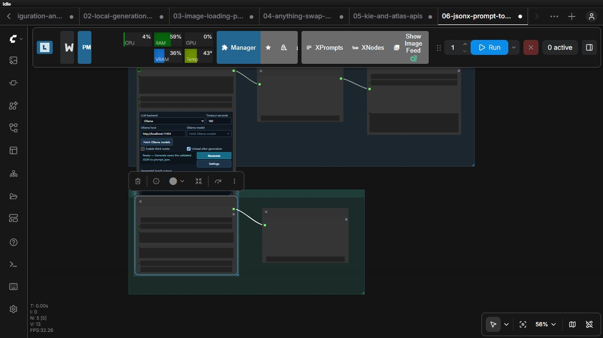

### WorkflowX: Replace node...

The searchable dialog lists every registered node except the current class and can be filtered by display name, internal class, or category.

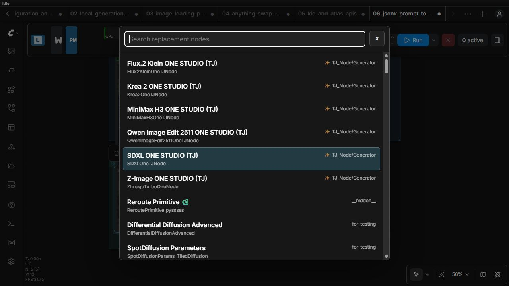

On replacement, WorkflowX preserves position, colors, mode, flags, a custom title, and a size large enough for the replacement. Matching widget names are copied. Input and output slots are matched by name and compatible type first, then by compatible type. Wildcard sockets are supported.

Incompatible links are skipped rather than forced, and a result notification reports kept links, skipped links, and copied widget values. Arbitrary node-specific hidden properties are not guaranteed to transfer.

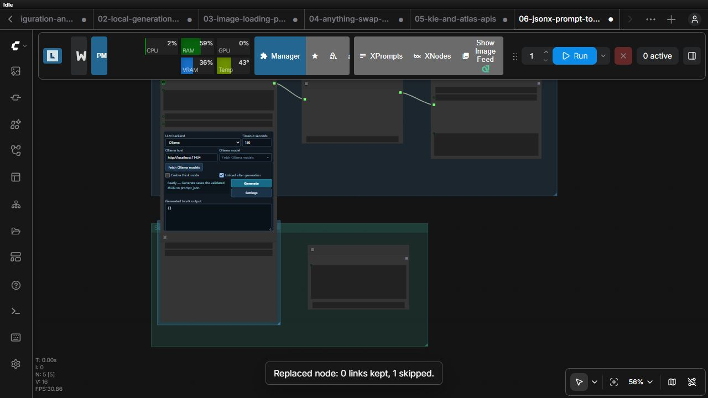

## Examples

| Workflow | Demonstrates | Execution |
|---|---|---|
| [Configuration and routing](examples/01-configuration-and-routing.json) | Config SelectorX, every typed Set/Get pair, Relay, real consumers | Model-dependent |
| [Local generation and model management](examples/02-local-generation-and-model-management.json) | Load Diffusion Model X, Load ImageX, Unified Autoprompter, LoraX, unload ordering, Save Video X | Model/resource-dependent |
| [Image loading, processing, and comparison](examples/03-image-loading-processing-and-comparison.json) | Both loaders, masks, Image ProcessorX, Image Compare Edit X | Local images required |
| [Anything Swap with NanoBanana](examples/04-anything-swap-with-nanobanana.json) | Advanced loader, crop, remote edit, stitch, previews | API-dependent |
| [Kie and Atlas APIs](examples/05-kie-and-atlas-apis.json) | Separate provider branches with previews | API-dependent |
| [JsonX prompt toolchain](examples/06-jsonx-prompt-toolchain.json) | LLM, builder, importer, randomizer | Partly local/profile-dependent |
| [Advanced configured production](examples/07-advanced-configured-production.json) | Sanitized production pattern using configuration, relay, LoRA, cleanup, and video | Model-dependent |

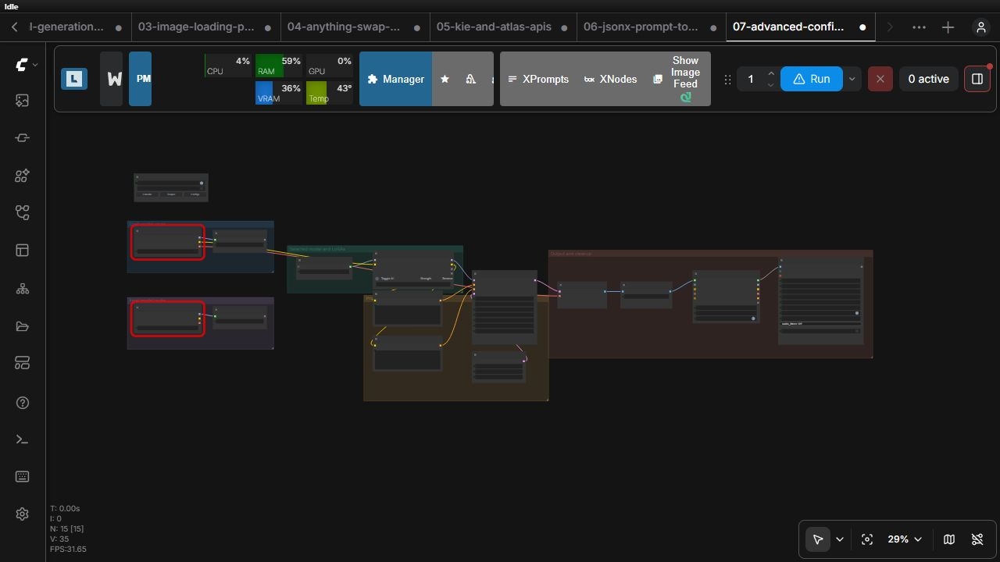

## Acknowledgements

WorkflowX Configurator is built for the [ComfyUI](https://github.com/Comfy-Org/ComfyUI) ecosystem and benefits from the ideas, conventions, and open work shared across its custom-node community. The project as a whole, not only the nodes named below, reflects that wider ecosystem. Particular thanks go to:

- [ComfyUI-Pixaroma](https://gitlab.com/pixaroma/comfyui-pixaroma) for UI inspiration and the adjustment behavior adapted for Image Compare Edit X.
- [ComfyUI-Curve](https://github.com/aiaiaikkk/ComfyUI-Curve) for the curve-editor interaction model adapted for Image Compare Edit X.
- [ComfyUI-Lora-Manager](https://github.com/willmiao/ComfyUI-Lora-Manager) for the metadata, preview, and model-library APIs with which LoraX interoperates, and for helping establish the visual LoRA-management patterns LoraX develops further.
- [llama.cpp](https://github.com/ggml-org/llama.cpp), [Ollama](https://github.com/ollama/ollama), and the prompting guidance published across supported model ecosystems, which informed Unified Autoprompter X's local and provider-backed prompt workflow.
- The original Anything Swap Bridge implementation and `AnythingCropForSwap` / `AnythingStitch` contract, which WorkflowX preserves while extending the workflow with model-agnostic editing, stronger geometry and mask handling, and native ComfyUI SAM3 support.
- [ComfyUI NanoBanana Full API](https://github.com/haroonaslam/ComfyUI_NanoBanana_Full_API) for the original NanoBanana node that WorkflowX updates while preserving workflow compatibility.
- The bundled AFJ project for its visual JSON prompting foundation, and GemMobi for the canonical model contracts used by the Kie and Atlas image API nodes.

Some WorkflowX nodes preserve an established workflow contract while expanding, enhancing, or adapting its functionality for different use cases and a more unified experience. Others combine familiar interaction patterns with new implementations or interoperate with adjacent projects. These acknowledgements recognize those foundations; the resulting WorkflowX nodes may differ substantially in interface, scope, and behavior.

## Migration, compatibility, and troubleshooting

- Current workflows should use Config SelectorX. The four earlier configurator nodes remain registered only so old workflows can load; see [legacy migration](docs/LEGACY_MIGRATION.md).
- Example resource names are placeholders. Select local images, checkpoints, LoRAs, masks, audio, and codecs after loading.
- API examples have blank credentials and should not be queued until credentials and provider settings are configured.
- If a node is missing, restart ComfyUI after updating WorkflowX and confirm the node ID appears in `/object_info`.
- If a UI button is missing, hard-refresh the browser so the current frontend extensions load.
- For detailed feature guides, use the [documentation index](docs/README.md).

WorkflowX does not rename active node IDs or rewrite ComfyUI's workflow serialization format.
