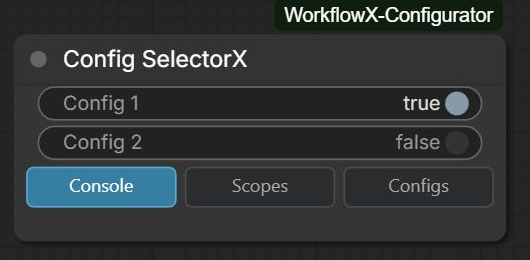
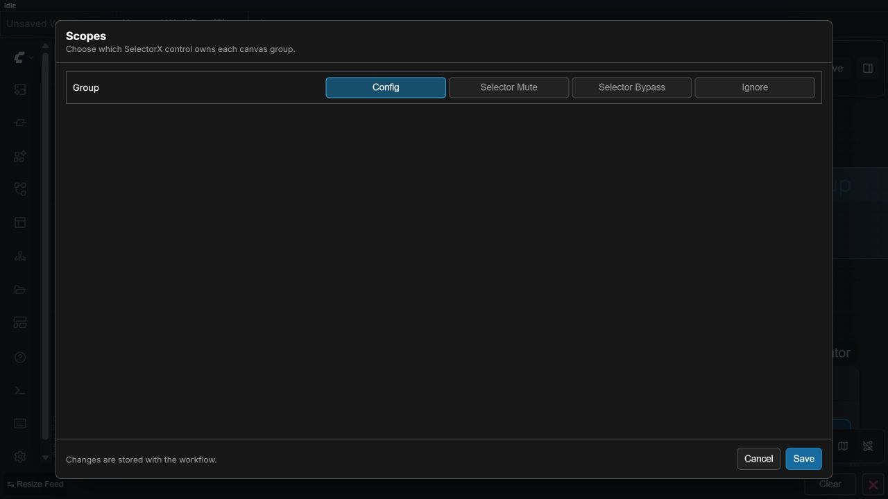
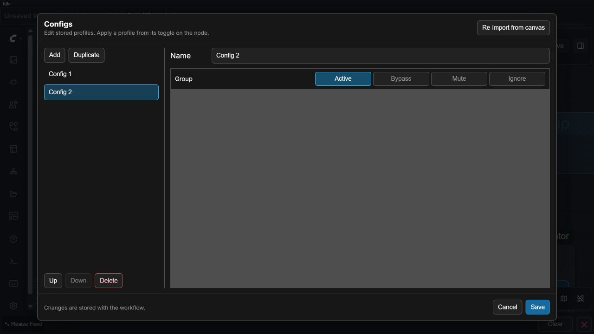

# Config SelectorX

Config SelectorX (`KVGC_ConfigSelectorX`) is the only configuration controller recommended for new workflows. Its **Scopes** and **Configs** buttons replace the old chain of separate configurator nodes.

## Workflow

1. Put typed Set nodes inside meaningful ComfyUI groups.
2. Add Config SelectorX and open **Scopes**.
3. Create a scope and select the groups it owns.
4. Open **Configs**, create a named configuration, and capture/edit the scoped values.
5. Place matching Get nodes at their consumers and select the configuration on Config SelectorX.

Keys should be unique within a scope and Set/Get types must match. Get-node resolution metadata is UI-managed and should not be edited manually. Config SelectorX persists scopes, configurations, the active selection, and a digest in workflow JSON; it revalidates the stored state when a workflow loads.

Use Relay for values that cannot be represented by the seven typed families. The Set Relay output remains on the execution path, while Get Relay resolves the selected value or its connected fallback.

See the [configuration and routing example](../examples/01-configuration-and-routing.json), the [advanced production example](../examples/07-advanced-configured-production.json), and the exact [node contracts](../README.md#workflow-configuration-and-routing).
