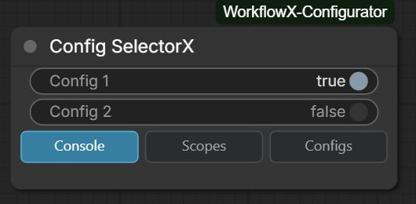
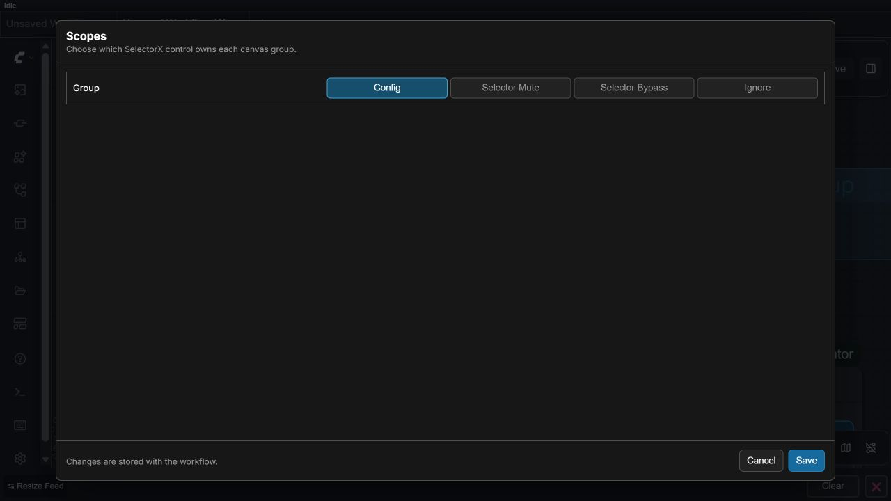
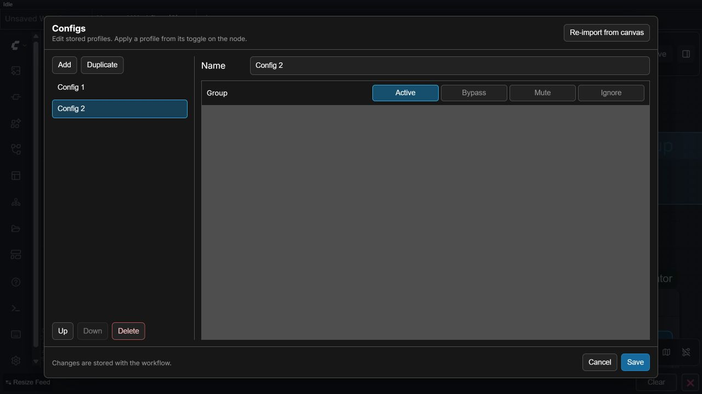

# Config SelectorX

Config SelectorX (`KVGC_ConfigSelectorX`) is the only configuration controller recommended for new workflows. Its **Scopes** and **Configs** buttons replace the old chain of separate configurator nodes.

## Workflow

1. Put typed Set nodes inside meaningful ComfyUI groups on the canvas or in subgraphs.
2. Add one Config SelectorX to the root canvas and open **Scopes**.
3. Create a scope and select the groups it owns.
4. Open **Configs**, create a named configuration, and capture/edit the scoped values.
5. Place matching Get nodes at their consumers and select the configuration on Config SelectorX.

The root Config SelectorX discovers every group in reachable nested subgraphs. Subgraph group modes are definition-wide, so changing one applies to every instance of that subgraph definition. Do not add a Config SelectorX inside a subgraph: nested selectors are ignored and reported as a warning. More than one initialized Config SelectorX on the root canvas blocks queueing; legacy configuration remains root-only when no initialized Config SelectorX exists.

Every non-empty group name must be unique across the root canvas and reachable subgraph definitions. Names are compared after Unicode normalization, trimming, and case folding, while the original spelling is retained for display. A repeated instance of one shared subgraph definition does not duplicate its logical groups. Blank group names are ignored. Duplicate names are shown with their locations and block queueing until they are renamed.

## Set/Get resolution

Keys are trimmed, case-sensitive, and family-specific. For example, Integer `steps` and String `steps` do not collide. Every typed family, Relay, Dimensions, and Reference uses the same precedence:

| Tier | Candidate |
|---:|---|
| 1 | Active ungrouped root Set, including a Set in a root group whose scope is **Ignore** |
| 2 | Active root Set inside exactly one controlled group |
| 3 | Active Set in any reachable subgraph, grouped or ungrouped |

The first non-empty tier wins for Gets anywhere in the graph. A root Get can resolve a nested Set, and a nested Get can resolve a root Set. Muted or bypassed Sets and Sets below a muted or bypassed subgraph wrapper are excluded. A Set intersecting more than one controlled group is invalid.

Exactly one active candidate is allowed in the winning tier. Multiple candidates there block queueing and report the family, key, tier, execution paths, and group locations. Duplicate candidates in a shadowed lower tier produce a warning but do not block a valid root override. Each runtime instance of a shared subgraph Set is a separate candidate because promoted inputs may differ per instance; if two instances reach the winning tier, the user must disable or rename one.

Relay, Dimensions, and Reference routing uses the full nested execution path. Direct-input fallbacks remain available when no Set resolves. Reference mute behavior also applies to nested Get Reference instances and removes dangling prompt inputs in the same way as native mute serialization.

Get-node resolution metadata is UI-managed and should not be edited manually. Typed provenance binds the configuration, effective modes, selected execution path, family, key, and value. Older or stale provenance is re-resolved from the workflow rather than trusted. Config SelectorX retains state schema version 1, so existing workflows require no migration.

Use Relay for values that cannot be represented by the seven typed families. The Set Relay output remains on the execution path, while Get Relay resolves the selected value or its connected fallback.

See the [configuration and routing example](../examples/01-configuration-and-routing.json), the [advanced production example](../examples/07-advanced-configured-production.json), and the exact [node contracts](../README.md#workflow-configuration-and-routing).
