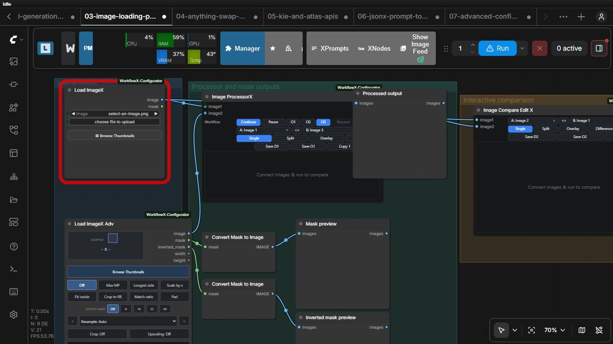

# WorkflowX image loaders

WorkflowX provides a standard loader and an advanced loader. Both use ComfyUI's input directory and return normalized image/mask tensors.

## Load ImageX

Choose or upload an image. The node returns `IMAGE` and an alpha-derived `MASK`, following the familiar ComfyUI loader contract.

## Load ImageX Adv

The advanced loader adds mask editing, an inverted mask, and explicit width/height outputs. Its `workflowx_state` field is managed by the frontend editor and saved in the workflow; do not wire or edit it as an ordinary input.

See the [working image-tools example](../examples/03-image-loading-processing-and-comparison.json) and the [canonical contracts](../README.md#image-and-media-loading).
