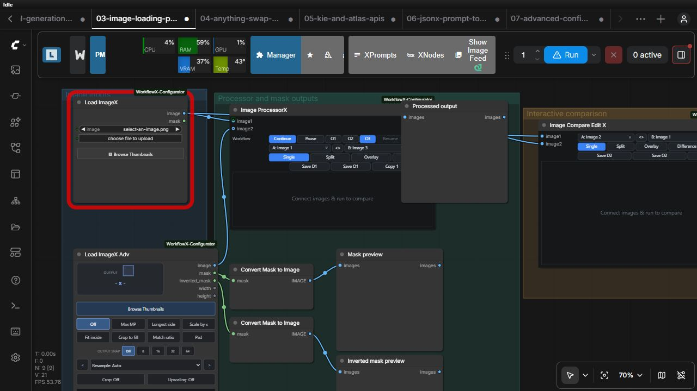

# WorkflowX image loaders

WorkflowX provides a standard loader and an advanced loader. Both return normalized image/mask tensors; the advanced loader also supports temporary images outside the input directory.

## Load ImageX

Choose or upload an image. The node returns `IMAGE` and an alpha-derived `MASK`, following the familiar ComfyUI loader contract.

## Load ImageX Adv

The advanced loader adds mask editing, an inverted mask, and explicit width/height outputs. Its `workflowx_state` field is managed by the frontend editor and saved in the workflow; do not wire or edit it as an ordinary input.

The compact Resample dropdown sits beside **Mode: Normal / Direct**. Normal (the default for existing workflows) uploads to ComfyUI inputs. Direct routes Upload Photo, image drag-and-drop, and image clipboard paste to a private temporary slot instead. Select the node or focus its controls before pasting; text paste and node copy/paste are unaffected.

Direct retains the original file bytes, including alpha and multi-frame data. Each live node instance reuses one temporary file, atomically replacing it after validation. Different nodes/tabs use separate slots. Mode changes apply to the next upload and never move or delete the current source. Browse Thumbnails still selects existing input images.

Temporary sources are not embedded in workflows and may disappear when ComfyUI restarts. Saved workflows retain the mode and source reference, but missing images must be uploaded or pasted again. Duplicates initially reference the same image; their next uploads use independent slots. Replacing a temporary source changes what a queued execution will read if it has not loaded that image yet. Use Normal for durable workflows and avoid replacing sources while their jobs are queued.

See the [working image-tools example](../examples/03-image-loading-processing-and-comparison.json) and the [canonical contracts](../README.md#image-and-media-loading).
