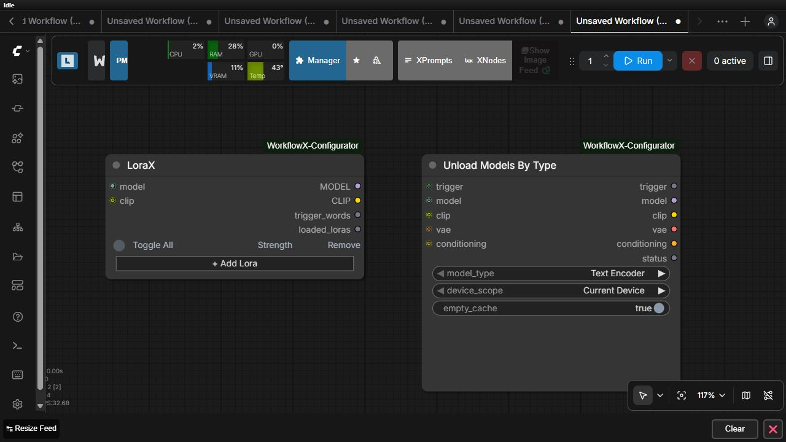

# LoraX

LoraX applies an ordered LoRA stack to a required model and an optional CLIP input.

Use the node buttons to add, remove, reorder, search, and refresh LoRA rows. Each populated row stores the installed LoRA filename plus model and CLIP strengths. Rows execute top-to-bottom, so order can affect the result. Empty rows are ignored and missing files are reported.

Outputs include the transformed `MODEL`, transformed `CLIP`, aggregated `trigger_words`, and a `loaded_loras` audit string. Workflows remain portable only when the receiving installation has equivalent LoRA files.

The paired Unload Models By Type example demonstrates releasing selected components after use. See the [local generation example](../examples/02-local-generation-and-model-management.json) and the [exact contracts](../README.md#model-and-lora-management).
