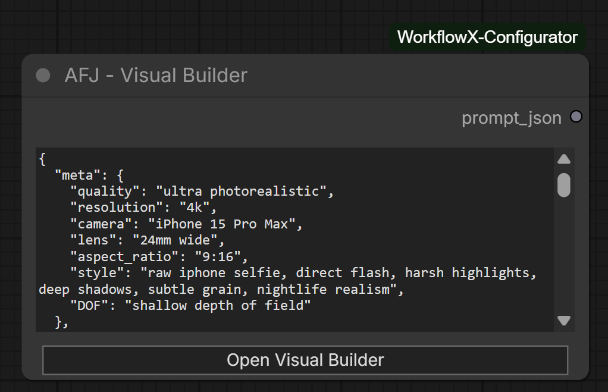
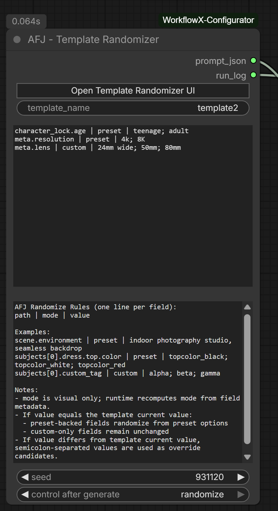
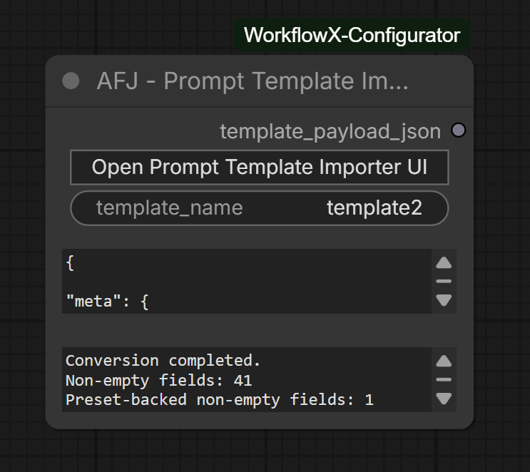

# WorkflowX Node Reference

This reference covers every ComfyUI node registered by WorkflowX Configurator. The main package appears under `WorkflowX_Configurator`; bundled AFJ nodes appear under `AFJ`.

For the Image Compare Edit X expanded editor, see [Image Compare Edit X Editor Guide](IMAGE_COMPARE_EDIT_X_EDITOR.md). For Autoprompter backend setup and profile editing, see [Unified Autoprompter X Guide](UNIFIED_AUTOPROMPTER_X.md).

## Registered Nodes

| Node | Category | Purpose |
| --- | --- | --- |
| `Set Int` / `Get Int` | `WorkflowX_Configurator` | Publish and read integer values by key. |
| `Set Float` / `Get Float` | `WorkflowX_Configurator` | Publish and read float values by key. |
| `Set String` / `Get String` | `WorkflowX_Configurator` | Publish and read single-line strings by key. |
| `Set Text` / `Get Text` | `WorkflowX_Configurator` | Publish and read multiline text by key. |
| `Set Boolean` / `Get Boolean` | `WorkflowX_Configurator` | Publish and read boolean values by key. |
| `Set Sampler` / `Get Sampler` | `WorkflowX_Configurator` | Publish and read ComfyUI sampler choices by key. |
| `Set Scheduler` / `Get Scheduler` | `WorkflowX_Configurator` | Publish and read ComfyUI scheduler choices by key. |
| `Set Relay` / `Get Relay` | `WorkflowX_Configurator` | Route live graph values by key. |
| `Group Configurator` | `WorkflowX_Configurator` | Define one named workflow profile and each group mode. |
| `Config Selector` | `WorkflowX_Configurator` | Select one active profile. |
| `Config Selector Advanced` | `WorkflowX_Configurator` | Select one profile plus scoped group mute/bypass toggles. |
| `Group Scopes` | `WorkflowX_Configurator` | Decide which groups appear in configurators or advanced selector sections. |
| `Unload Models By Type` | `WorkflowX_Configurator/VRAM` | Unload selected resident model classes from memory. |
| `Image Compare Edit X` | `WorkflowX_Configurator/Image` | Compare two images and edit/save an in-node Image 3 blend. |
| `Unified Autoprompter X` | `WorkflowX_Configurator/Prompting` | Build model-specific prompts from the WorkflowX autoprompting UI. |
| `AFJ - Visual Builder` | `AFJ` | Build structured prompt JSON visually. |
| `AFJ - Template Randomizer` | `AFJ` | Randomize fields from saved AFJ templates at runtime. |
| `AFJ - Prompt Template Importer` | `AFJ` | Convert final prompt JSON into an AFJ template payload. |

## Typed Set/Get Nodes

WorkflowX typed nodes let one selected profile decide values used throughout a workflow. A `Set` node publishes a value under a `key`; the matching `Get` node reads that key at queue time.


| Setter | Getter | Set input | Get output | Common use |
| --- | --- | --- | --- | --- |
| `Set Int` | `Get Int` | `INT` | `INT` | steps, seed offsets, batch counts |
| `Set Float` | `Get Float` | `FLOAT` | `FLOAT` | CFG, denoise, strength |
| `Set String` | `Get String` | `STRING` | `STRING` | model names, short labels |
| `Set Text` | `Get Text` | multiline `STRING` | `STRING` | prompts or longer notes |
| `Set Boolean` | `Get Boolean` | `BOOLEAN` | `BOOLEAN` | switches and feature flags |
| `Set Sampler` | `Get Sampler` | sampler dropdown | sampler dropdown | sampler profiles |
| `Set Scheduler` | `Get Scheduler` | scheduler dropdown | scheduler dropdown | scheduler profiles |

`Set` inputs:

- `key`: name to publish.
- `value`: typed value.

`Get` inputs:

- `key`: name to read.
- `resolved_value`, `resolved_config`, and `resolved_digest`: internal fields managed by the frontend extension.

Behavior:

- Global `Set` nodes outside configured groups win over grouped values.
- If there is no global value, WorkflowX uses the matching `Set` inside the active profile group.
- `Get` nodes are materialized immediately before queueing, so switching profiles does not require a browser refresh.
- Duplicate eligible `Set` nodes are resolved deterministically, but are easier to maintain if removed.

## Set Relay / Get Relay

Relay nodes route actual graph values rather than serialized widget values.


`Set Relay` inputs and outputs:

| Name | Type | Notes |
| --- | --- | --- |
| `key` | `STRING` | Relay name. |
| `value` | wildcard | Any ComfyUI value, such as `MODEL`, `CLIP`, `VAE`, `IMAGE`, `MASK`, `CONDITIONING`, or `LATENT`. |
| `value` | wildcard output | Passthrough output. |

`Get Relay` inputs and outputs:

| Name | Type | Notes |
| --- | --- | --- |
| `key` | `STRING` | Relay name to read. |
| `value` | optional wildcard | Managed by WorkflowX queue-time relay patching, or manually connected as fallback. |
| `value` | wildcard output | Resolved relay value. |

Use relays for checkpoint switching, LoRA chains, image/mask branches, and other values that cannot be represented as primitive widgets. Relays stay wireless by key; WorkflowX patches the queued prompt rather than adding visible links between relay nodes.

## Group Configurator

`Group Configurator` defines one named profile, such as `Speed`, `Quality`, or `Realism`.


Inputs:

| Name | Type | Notes |
| --- | --- | --- |
| `config_name` | `STRING` | Profile name shown in selector nodes. |
| `config_json` | `STRING` | Internal JSON mapping group names to modes. Managed by the frontend. |

Group modes:

| Mode | Meaning |
| --- | --- |
| `Active` | Group nodes are normal and eligible for scoped Set/Get lookup. |
| `Bypass` | Group nodes are bypassed and ignored for scoped lookup. |
| `Mute` | Group nodes are muted and ignored for scoped lookup. |
| `Ignore` | WorkflowX leaves the group state unchanged and treats values as unscoped/global. |

Use `Refresh groups` after adding, deleting, or renaming ComfyUI groups.

## Config Selector

`Config Selector` chooses one active `Group Configurator` profile.


Inputs:

| Name | Type | Notes |
| --- | --- | --- |
| `selected_config` | `STRING` | Internal selected profile name. Managed by the frontend toggle UI. |
| `console_output` | `no` / `yes` | Enables queue-time lookup logging in the browser console. |

When one profile is enabled, the others are turned off. The selected profile is applied immediately in the canvas and again during queue-time resolution.

## Config Selector Advanced

`Config Selector Advanced` adds scoped group mute/bypass controls on top of normal profile selection.


Inputs:

| Name | Type | Notes |
| --- | --- | --- |
| `selected_config` | `STRING` | Internal selected profile name. |
| `console_output` | `no` / `yes` | Enables browser console debug logs. |
| `advanced_state` | `STRING` | Internal JSON for advanced mute and bypass switch states. |

Advanced sections are controlled by `Group Scopes`. They are useful when you want one selected profile plus quick local toggles for optional groups.

## Group Scopes

`Group Scopes` decides where each canvas group should appear.


Input:

| Name | Type | Notes |
| --- | --- | --- |
| `scopes_json` | `STRING` | Internal JSON mapping group names to scope modes. |

Scope modes:

| Mode | Meaning |
| --- | --- |
| `Group Configurator` | Show the group in `Group Configurator`. |
| `Selector Mute` | Show the group in advanced selector mute controls. |
| `Selector Bypass` | Show the group in advanced selector bypass controls. |
| `Ignore` | Hide the group from WorkflowX config/scoped selector UI. |

If no `Group Scopes` node exists, all groups appear in `Group Configurator` and none appear in advanced selector sections. If duplicate `Group Scopes` nodes exist, WorkflowX falls back to default behavior until duplicates are removed.

## Unload Models By Type

`Unload Models By Type` is a VRAM utility node for freeing currently resident ComfyUI models while keeping the workflow chain connected.

Inputs:

| Name | Type | Notes |
| --- | --- | --- |
| `model_type` | dropdown | Selects which loaded model family to unload. |
| `device_scope` | dropdown | Limits unload matching to the current device or broader loaded-model scope. |
| `empty_cache` | `BOOLEAN` | Calls cache cleanup after unload when enabled. |
| `trigger` | optional wildcard | Passthrough trigger for ordering. |
| `model` | optional `MODEL` | Passthrough. |
| `clip` | optional `CLIP` | Passthrough. |
| `vae` | optional `VAE` | Passthrough. |
| `conditioning` | optional `CONDITIONING` | Passthrough. |

Outputs:

| Name | Type | Notes |
| --- | --- | --- |
| `trigger` | wildcard | Returns the first connected passthrough input. |
| `model` | `MODEL` | Original model input. |
| `clip` | `CLIP` | Original clip input. |
| `vae` | `VAE` | Original vae input. |
| `conditioning` | `CONDITIONING` | Original conditioning input. |
| `status` | `STRING` | Human-readable unload summary. |

Use it inline before a heavy stage when you want to release a model family before the next stage begins. For example, place it after text encoding to unload text encoders before sampling, or before text encoding to unload diffusion models.

## Image Compare Edit X

`Image Compare Edit X` compares two `IMAGE` inputs and provides an in-node Image 3 editor. Image 3 is browser-side editor state; it is not a graph output.

Inputs:

| Name | Type | Notes |
| --- | --- | --- |
| `image1` | `IMAGE` | First source image. |
| `image2` | `IMAGE` | Second source image. |

Outputs:

| Name | Type | Notes |
| --- | --- | --- |
| none | - | Output node only. The UI can save or copy Image 1, Image 2, or Image 3. |

Core behavior:

- Compare Image 1, Image 2, and in-node Image 3 using single, split, overlay, and difference views.
- Open the expanded editor to blend sources, paint masks, create adjustment layers, edit curves, and save/copy the final Image 3.
- `Save O3` writes Image 3 to ComfyUI output with workflow metadata.
- `Save D3` downloads Image 3 through the browser.
- `Copy 3` copies Image 3 to the clipboard.

See [Image Compare Edit X Editor Guide](IMAGE_COMPARE_EDIT_X_EDITOR.md) for the full editing workflow.

## Unified Autoprompter X

`Unified Autoprompter X` builds model-targeted prompt text from the WorkflowX autoprompting UI.

Inputs:

| Name | Type | Notes |
| --- | --- | --- |
| `target_model` | dropdown | Prompt profile target, such as an image or prompt model profile. |
| `prompt_format` | dropdown | Output format. The node normalizes invalid choices for the selected target. |
| `negative_enabled` | `BOOLEAN` | Controls whether negative prompt text is emitted. |
| `enable_bbox_json_input` | `BOOLEAN` | UI-managed toggle for syncing connected bbox JSON into BBox Layout. |
| `enable_text_input` | `BOOLEAN` | UI-managed toggle for using connected raw prompt text during generation. |
| `refresh_vram` | `BOOLEAN` | UI-managed toggle for unloading ComfyUI models and clearing cache before prompt generation. |
| `generated_positive` | multiline `STRING` | Managed by the frontend UI. |
| `generated_negative` | multiline `STRING` | Managed by the frontend UI. |
| `final_prompt` | multiline `STRING` | Managed by the frontend UI. |
| `image` | optional `IMAGE` | Optional image context for frontend-assisted prompting. |
| `bbox_json` | optional `STRING` | Optional connected raw bbox JSON for BBox Layout sync. |
| `raw_prompt_text` | optional `STRING` | Optional connected raw prompt text or JSON for backend refinement. |
| `ui_state` | optional `STRING` | Internal UI state JSON. |

Outputs:

| Name | Type | Notes |
| --- | --- | --- |
| `prompt` | `STRING` | Final prompt string for the selected format. |
| `positive` | `STRING` | Positive prompt output. |
| `negative` | `STRING` | Negative prompt output, or empty when disabled. |

Use this node when you want one prompt-building surface that can target multiple prompt formats while preserving positive/negative text outputs for downstream nodes. For backend setup, model profiles, connected images/text, video fields, and BBox Layout helpers, see [Unified Autoprompter X Guide](UNIFIED_AUTOPROMPTER_X.md).

## AFJ - Visual Builder

`AFJ - Visual Builder` creates structured JSON prompts from a visual tree editor.



Inputs:

| Name | Type | Notes |
| --- | --- | --- |
| `prompt_json` | optional multiline `STRING` | Current JSON prompt payload. |

Outputs:

| Name | Type | Notes |
| --- | --- | --- |
| `prompt_json` | `STRING` | Clean JSON object, or an error payload if the input JSON is invalid. |

Click `Open Visual Builder` to edit the prompt tree, attach preset-backed fields, save/load templates, and apply the compiled JSON back to the node.

## AFJ - Template Randomizer

`AFJ - Template Randomizer` loads a saved AFJ template and randomizes selected fields at queue time.



Inputs:

| Name | Type | Notes |
| --- | --- | --- |
| `template_name` | optional `STRING` | Saved template to load. |
| `randomize_rules` | optional multiline `STRING` | One rule per field. |
| `randomize_rules_help` | optional multiline `STRING` | UI helper text. |
| `seed` | optional `INT` | `0` uses random entropy; positive values are repeatable. |

Outputs:

| Name | Type | Notes |
| --- | --- | --- |
| `prompt_json` | `STRING` | Generated prompt JSON. |
| `run_log` | `STRING` | Runtime report of processed, skipped, or invalid rules. |

Rule format:

```text
path | mode | value
```

The runtime recomputes whether each field is preset-backed or custom from the saved template metadata.

## AFJ - Prompt Template Importer

`AFJ - Prompt Template Importer` converts final prompt JSON into an AFJ template payload.



Inputs:

| Name | Type | Notes |
| --- | --- | --- |
| `template_name` | optional `STRING` | Template name used by the importer UI. |
| `source_prompt_json` | optional multiline `STRING` | Final prompt JSON object to convert. |
| `import_report` | optional multiline `STRING` | UI-managed conversion report. |

Outputs:

| Name | Type | Notes |
| --- | --- | --- |
| `template_payload_json` | `STRING` | Converted template payload, or an error payload. |

Use the importer when you already have final prompt JSON and want to turn it into a reusable AFJ template. The importer rejects AFJ metadata payloads such as existing `tree` / `randomizer_checked` template JSON; paste the final prompt object instead.

## Bundled Frontend Tools

XFlows, XPrompts, and XNodes are bundled WorkflowX frontend tools. They register routes and sidebar/settings UI, but they do not register ComfyUI node classes in `NODE_DISPLAY_NAME_MAPPINGS`.

- `XFlows`: workflow browsing, tagging, favorites, duplicate detection, move, import, and export.
- `XPrompts`: saved prompt and preset snippet library.
- `XNodes`: saved node and node-group snippets.
