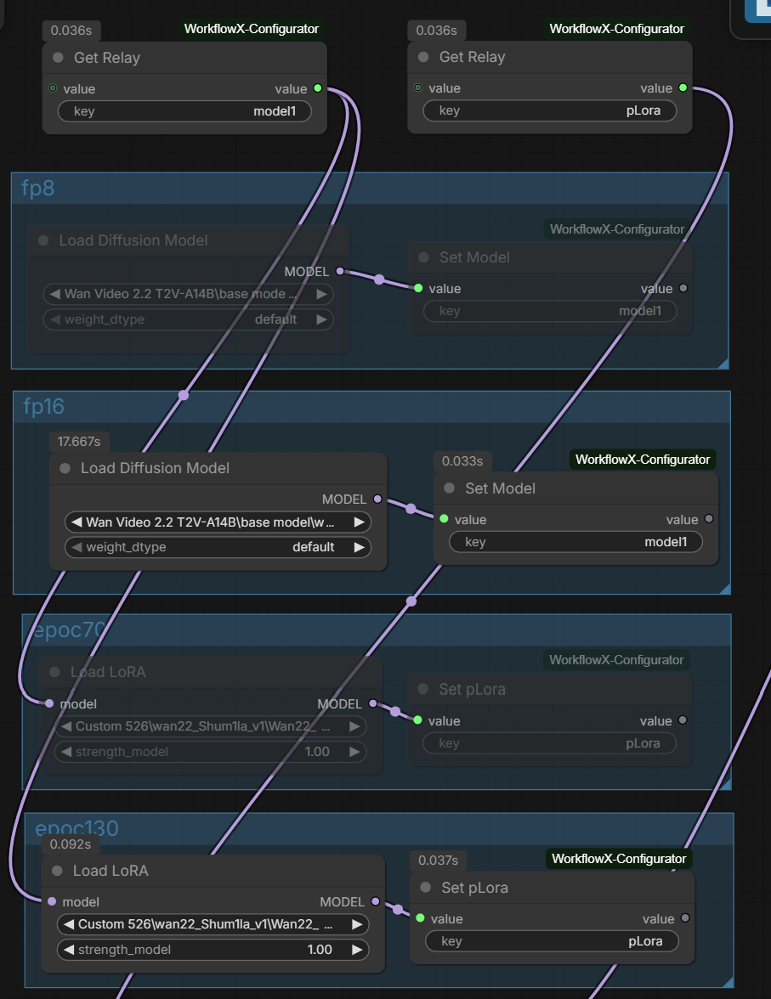
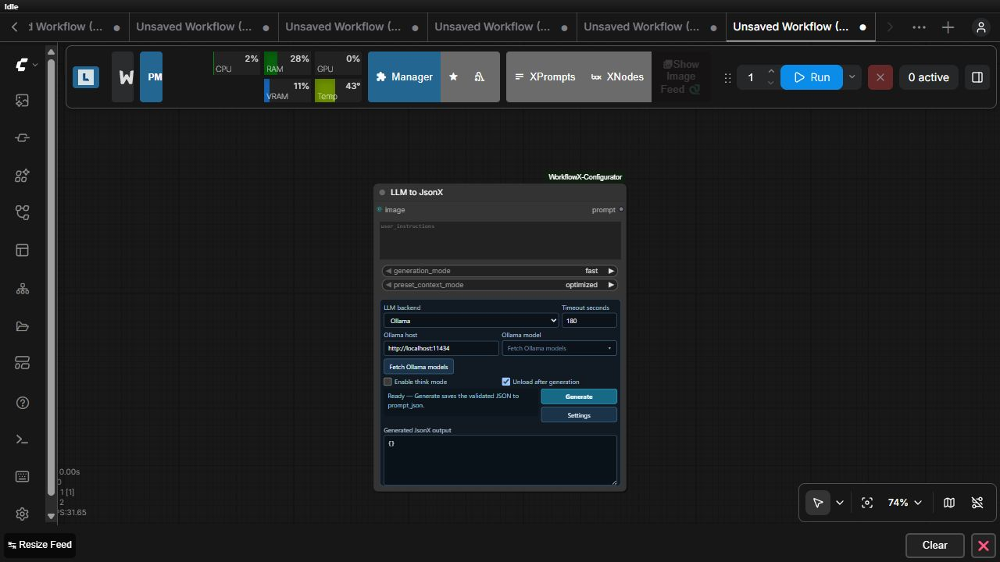
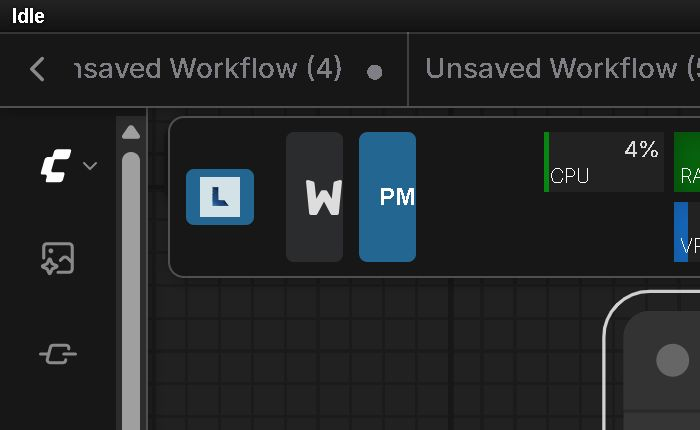
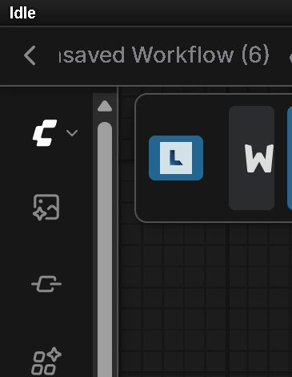
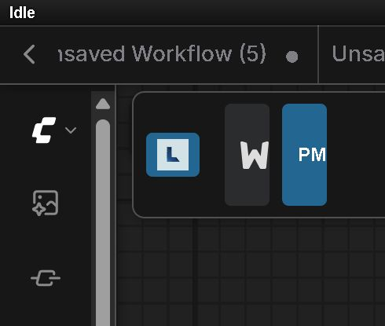

# WorkflowX Node Reference

This reference covers every ComfyUI node registered by WorkflowX Configurator. JsonX nodes appear under `WorkflowX/Prompting/JsonX`.

For the Image Compare Edit X expanded editor, see [Image Compare Edit X Editor Guide](IMAGE_COMPARE_EDIT_X_EDITOR.md). For downstream image processing and workflow control, see [Image ProcessorX Guide](IMAGE_PROCESSOR_X.md). For crop/edit/stitch workflows, see [Anything Swap Bridge Guide](ANYTHING_SWAP_BRIDGE.md). For Google Gemini image generation, see [NanoBanana Full API Guide](NANOBANANA_FULL_API.md). For Kie and Atlas generation, see [Kie and Atlas Image API Nodes](KIE_ATLAS_API_NODES.md). For Autoprompter backend setup and profile editing, see [Unified Autoprompter X Guide](UNIFIED_AUTOPROMPTER_X.md).

## Registered Nodes

| Node | Category | Purpose |
| --- | --- | --- |
| `Set Int` / `Get Int` | `WorkflowX/Get Set Go` | Publish and read integer values by key. |
| `Set Float` / `Get Float` | `WorkflowX/Get Set Go` | Publish and read float values by key. |
| `Set String` / `Get String` | `WorkflowX/Get Set Go` | Publish and read single-line strings by key. |
| `Set Text` / `Get Text` | `WorkflowX/Get Set Go` | Publish and read multiline text by key. |
| `Set Boolean` / `Get Boolean` | `WorkflowX/Get Set Go` | Publish and read boolean values by key. |
| `Set Sampler` / `Get Sampler` | `WorkflowX/Get Set Go` | Publish and read ComfyUI sampler choices by key. |
| `Set Scheduler` / `Get Scheduler` | `WorkflowX/Get Set Go` | Publish and read ComfyUI scheduler choices by key. |
| `Set Relay` / `Get Relay` | `WorkflowX/Get Set Go` | Route live graph values by key. |
| `Config SelectorX` | `WorkflowX/Workflow Config` | Manage, select, and migrate configs and scopes from one self-contained node. |
| `Group Configurator` / `Group Scopes` | `WorkflowX/Deprecated` | Legacy config definition and scope nodes; retained for existing workflows. |
| `Config Selector` / `Config Selector Advanced` | `WorkflowX/Deprecated` | Legacy selector nodes; retained for existing workflows. |
| `Unload Models By Type` | `WorkflowX/VRAM` | Unload selected resident model classes from memory. |
| `Image Compare Edit X` | `WorkflowX/Image Compare` | Compare two images and edit/save an in-node Image 3 blend. |
| `Image ProcessorX` | `WorkflowX/Image Compare` | Process one or two images and pass O1, O2, or rendered O3 downstream, immediately or after an interactive pause. |
| `Load ImageX` | `WorkflowX/Image Loader` | Load from input and nested input folders through a cached thumbnail grid. |
| `Load ImageX Adv` | `WorkflowX/Image Loader` | Browse, crop, resize, snap, resample, or pad an input image in one node. |
| `Anything Crop (for Swap)` | `WorkflowX/Anything Swap` | Segment or mask an object, crop it, and create a stitch payload. |
| `Anything Stitch` | `WorkflowX/Anything Swap` | Composite an edited crop back into the untouched source. |
| `NanoBanana Full API` | `WorkflowX/API` | Generate or edit images through current Google Gemini image models. |
| `Kie Image API X` | `WorkflowX/API` | Generate or edit one image through model-aware Kie routes with resumable retrieval. |
| `Atlas Image API X` | `WorkflowX/API` | Generate or edit one image through model-aware Atlas routes with resumable retrieval. |
| `Unified Autoprompter X` | `WorkflowX/Prompting` | Build model-specific prompts from the WorkflowX autoprompting UI. |
| `LLM to JsonX` | `WorkflowX/Prompting/JsonX` | Generate preset-aware JsonX from instructions and an optional image. |
| `JsonX - Visual Builder` | `WorkflowX/Prompting/JsonX` | Build structured prompt JSON visually. |
| `JsonX - Template Randomizer` | `WorkflowX/Prompting/JsonX` | Randomize fields from saved JsonX templates at runtime. |
| `JsonX - Prompt Template Importer` | `WorkflowX/Prompting/JsonX` | Convert final prompt JSON into a JsonX template payload. |

## Typed Set/Get Nodes

WorkflowX typed nodes let one selected profile decide values used throughout a workflow. A `Set` node publishes a value under a `key`; the matching `Get` node reads that key at queue time.


| Setter | Getter | Set input | Get output | Common use |
| --- | --- | --- | --- | --- |
| `Set Int` | `Get Int` | `INT` | `INT` | steps, seed offsets, batch counts |
| `Set Float` | `Get Float` | `FLOAT` | `FLOAT` | CFG, denoise, strength |
| `Set String` | `Get String` | `STRING` | `STRING` | model names, short labels |
| `Set Text` | `Get Text` | multiline `STRING` | `STRING` | prompts or longer notes |
| `Set Boolean` | `Get Boolean` | `BOOLEAN` | `BOOLEAN` | switches and feature flags |
| `Set Sampler` | `Get Sampler` | sampler dropdown | sampler dropdown | sampler profiles |
| `Set Scheduler` | `Get Scheduler` | scheduler dropdown | scheduler dropdown | scheduler profiles |

`Set` inputs:

- `key`: name to publish.
- `value`: typed value.

`Get` inputs:

- `key`: name to read.
- `resolved_value`, `resolved_config`, and `resolved_digest`: internal fields managed by the frontend extension.

Behavior:

- Global `Set` nodes outside configured groups win over grouped values.
- If there is no global value, WorkflowX uses the matching `Set` inside the active profile group.
- `Get` nodes are materialized immediately before queueing, so switching profiles does not require a browser refresh.
- Duplicate eligible `Set` nodes are resolved deterministically, but are easier to maintain if removed.

## Set Relay / Get Relay

Relay nodes route actual graph values rather than serialized widget values.



`Set Relay` inputs and outputs:

| Name | Type | Notes |
| --- | --- | --- |
| `key` | `STRING` | Relay name. |
| `value` | wildcard | Any ComfyUI value, such as `MODEL`, `CLIP`, `VAE`, `IMAGE`, `MASK`, `CONDITIONING`, or `LATENT`. |
| `value` | wildcard output | Passthrough output. |

`Get Relay` inputs and outputs:

| Name | Type | Notes |
| --- | --- | --- |
| `key` | `STRING` | Relay name to read. |
| `value` | optional wildcard | Managed by WorkflowX queue-time relay patching, or manually connected as fallback. |
| `value` | wildcard output | Resolved relay value. |

Use relays for checkpoint switching, LoRA chains, image/mask branches, and other values that cannot be represented as primitive widgets. Relays stay wireless by key; WorkflowX patches the queued prompt rather than adding visible links between relay nodes.

## Config SelectorX

`Config SelectorX` (`KVGC_ConfigSelectorX`) stores ordered configs, group scopes, and advanced Mute/Bypass state inside one versioned workflow payload. It is authoritative whenever at least one populated SelectorX exists; among multiple populated SelectorX nodes, the highest node id wins. Removing all SelectorX nodes restores the legacy selector behavior.


Internal inputs:

| Name | Type | Notes |
| --- | --- | --- |
| `selected_config` | `STRING` | Selected stored config. Managed by the node config rows. |
| `console_output` | `no` / `yes` | Toggled by the node's Console action button. |
| `selectorx_state` | `STRING` | Versioned JSON containing configs, scopes, and advanced toggle state. |

An empty SelectorX imports legacy canvas config nodes once. Duplicate config names resolve to the highest node id. Missing or duplicate legacy Group Scopes nodes use the legacy fallback and assign imported canvas groups to Config control. With no legacy configs, SelectorX creates `Config 1` and starts canvas groups in Ignore.

The Scopes and Configs buttons open isolated draft editors. Save serializes changes and Cancel discards them; neither editor applies modes. Config rows on the node apply and reapply profiles. Mute and Bypass switches keep the advanced selector convention: on is Active, while off applies Mute or Bypass.


## Legacy Nodes And Migration

The legacy `Group Configurator`, `Group Scopes`, `Config Selector`, and `Config Selector Advanced` nodes remain registered and unchanged. Workflows using only those nodes continue to resolve through the legacy system.

To migrate, add Config SelectorX while the legacy nodes are still present and let its empty state initialize once. SelectorX imports the effective configs, scopes, selected config, console setting, and advanced toggle state into its serialized payload. You can then save the workflow and remove the legacy configuration nodes. Use **Re-import from canvas** in the Configs editor only when you intentionally want to preview and replace the stored SelectorX draft.

When populated SelectorX nodes exist, the highest node id is authoritative. Removing every SelectorX node returns authority to the legacy nodes.

## Unload Models By Type

`Unload Models By Type` is a VRAM utility node for freeing currently resident ComfyUI models while keeping the workflow chain connected.

Inputs:

| Name | Type | Notes |
| --- | --- | --- |
| `model_type` | dropdown | Selects which loaded model family to unload. |
| `device_scope` | dropdown | Limits unload matching to the current device or broader loaded-model scope. |
| `empty_cache` | `BOOLEAN` | Calls cache cleanup after unload when enabled. |
| `trigger` | optional wildcard | Passthrough trigger for ordering. |
| `model` | optional `MODEL` | Passthrough. |
| `clip` | optional `CLIP` | Passthrough. |
| `vae` | optional `VAE` | Passthrough. |
| `conditioning` | optional `CONDITIONING` | Passthrough. |

Outputs:

| Name | Type | Notes |
| --- | --- | --- |
| `trigger` | wildcard | Returns the first connected passthrough input. |
| `model` | `MODEL` | Original model input. |
| `clip` | `CLIP` | Original clip input. |
| `vae` | `VAE` | Original vae input. |
| `conditioning` | `CONDITIONING` | Original conditioning input. |
| `status` | `STRING` | Human-readable unload summary. |

Use it inline before a heavy stage when you want to release a model family before the next stage begins. For example, place it after text encoding to unload text encoders before sampling, or before text encoding to unload diffusion models.

## Load ImageX

`Load ImageX` (`WorkflowX_LoadImageX`) recursively exposes supported images below ComfyUI's `input` directory. Selected values are stored as normalized input-relative paths, so nested values such as `Studio1/image.png` remain compatible with saved workflows and ComfyUI's normal upload behavior.

| Input | Type | Notes |
| --- | --- | --- |
| `image` | combo/upload | Image from the input root or any nested input folder. |

| Output | Type | Notes |
| --- | --- | --- |
| `image` | `IMAGE` | EXIF-corrected RGB image or same-size multi-frame batch. |
| `mask` | `MASK` | Inverted alpha channel, or a correctly sized blank mask when alpha is absent. |

The **Browse Thumbnails** modal provides All/root/folder navigation, path-aware search, refresh, lazy 80-item batches, and 128 px thumbnails. Enable **Batch mode** to add selection checkboxes and permanently delete selected images after confirmation. Thumbnails are cached under the ComfyUI user directory, keyed by path, size, modification time, and cache format. Browse and deletion requests are restricted to supported image files whose resolved paths remain inside `input`; output, temp, arbitrary paths, traversal, symlinks, and junctions are rejected.

## Load ImageX Adv

`Load ImageX Adv` (`WorkflowX_LoadImageXAdv`) shares the `Load ImageX` catalog and thumbnail cache. The selected file and processing state are serialized through hidden widgets; the visible node has no input sockets. Its outputs, in order, are `image` (`IMAGE`), `mask` (`MASK`), `inverted_mask` (`MASK`), `width` (`INT`), and `height` (`INT`). Width and height report the final processed dimensions, and `inverted_mask` is exactly `1 - mask` after crop, resize, padding, and snap.

The processing order is EXIF orientation, alpha-mask extraction, optional manual crop, selected resize mode, output snap, then tensor conversion. Available resize modes are Off, Max MP, Longest side, Scale by x, Fit inside, Crop to fill, Match ratio, and Pad. Resampling supports Auto, Nearest, Bilinear, Bicubic, and Lanczos. Padded pixels are marked in the output mask.

Crop mode supports drawing a new rectangle, moving it, resizing from corners, and clearing it by clicking outside. Crop Snap constrains only crop width and height; Output Snap independently constrains final dimensions. Both offer Off, 8, 16, 32, and 64. Turning Crop off bypasses but preserves the rectangle, while selecting a different image clears the rectangle and keeps the remaining controls.

Only the selected mode's controls are inserted into the node, and Crop Snap is removed from layout while Crop is off. The preview absorbs additional node height. The hidden native `image_upload` widget keeps ComfyUI's Open Image, Save Image, Clipspace, drag/drop, and Mask Editor actions available without showing a second preview. Mask Editor and Clipspace replacements preserve the normalized crop when dimensions match and clear it when they differ. Execution accepts containment-checked `[input]`, `[output]`, and `[temp]` annotations; browsing and deletion remain input-only.

## Image Compare Edit X

`Image Compare Edit X` compares two `IMAGE` inputs and provides an in-node Image 3 editor. Image 3 is browser-side editor state; it is not a graph output.

Inputs:

| Name | Type | Notes |
| --- | --- | --- |
| `image1` | `IMAGE` | First source image. |
| `image2` | `IMAGE` | Second source image. |

Outputs:

| Name | Type | Notes |
| --- | --- | --- |
| none | - | Output node only. The UI can save or copy Image 1, Image 2, or Image 3. |

Core behavior:

- Compare Image 1, Image 2, and in-node Image 3 using single, split, overlay, and difference views.
- Open the expanded editor to blend sources, paint masks, create adjustment layers, edit curves, and save/copy the final Image 3.
- `Save O3` writes Image 3 to ComfyUI output with workflow metadata.
- `Save D3` downloads Image 3 through the browser.
- `Copy 3` copies Image 3 to the clipboard.

See [Image Compare Edit X Editor Guide](IMAGE_COMPARE_EDIT_X_EDITOR.md) for the full editing workflow.

## Image ProcessorX

`Image ProcessorX` (`WorkflowX_ImageProcessorX`) is an independent processing node. Unlike Image Compare Edit X, it has a downstream `IMAGE` output and renders O3 authoritatively in Python.

Inputs:

| Name | Type | Notes |
| --- | --- | --- |
| `image1` | `IMAGE` | Required O1 source. |
| `image2` | optional `IMAGE` | Optional O2 source and two-image composition layer. |
| `operation_mode` | `Continue` / `Pause` | Continue processes immediately; Pause waits for an explicit Resume or Cancel action. |
| `output_image` | `O1` / `O2` / `O3` | Selects the single downstream image. O2 requires `image2`. |
| `processor_state` | internal `STRING` | Versioned editor state (`schemaVersion: 1`) managed by the frontend. |

Output:

| Name | Type | Notes |
| --- | --- | --- |
| `image` | `IMAGE` | Exact O1/O2 pass-through or rendered O3. |

O1 and O2 preserve their original tensors and batches. O3 applies the saved composition, masks, adjustment layers, and curves to every batch item. Equal batch sizes are paired; a one-item input broadcasts against the other batch; all other batch mismatches fail validation. In one-image mode, O3 starts from O1 and O2-only controls are unavailable.

Pause mode deliberately bypasses execution caching. The queued node remains pending indefinitely, survives frontend refresh through pending-session status lookup, and resumes with the latest output selection and editor state. Cancel releases the pending execution with an explicit cancellation error.

The frontend automatically persists the complete editor recipe across replacement images and workflow reloads, including blend and adjustment-brush masks. The expanded editor includes a full Reset action and named user-library presets; presets contain processing, layer, mask, curve, comparison, and editor settings but exclude base images and workflow routing.

See [Image ProcessorX Guide](IMAGE_PROCESSOR_X.md) for the editor workflow, state contract, routes, and troubleshooting.

## Anything Crop (for Swap)

`Anything Crop (for Swap)` accepts one `IMAGE` and either performs internal text-prompted SAM3 segmentation or uses an optional `MASK`. It selects one detected object, expands and aligns the crop, optionally resizes it, and returns:

- `crop`: the image region for the downstream editing model or API.
- `crop_mask`: the object mask in crop space.
- `swap_prompt`: the configured prompt with target, size, and caption tokens resolved.
- `source_masked`: a source preview with the selected object removed.
- `stitch`: an opaque `SWAP_STITCH` payload containing exact source geometry.
- `detected`: whether a usable object or mask was found.

The node accepts only a single source image. When `use_sam3` is off, a mask must be connected. See [Anything Swap Bridge Guide](ANYTHING_SWAP_BRIDGE.md) for the complete input and geometry behavior.

## Anything Stitch

`Anything Stitch` accepts the `SWAP_STITCH` payload and the edited `swapped` crop. It validates the returned resolution and aspect ratio, optionally colour-matches the edit against the original crop, builds the selected payload/full/override composite mask, feathers it, and returns the completed full-size image plus a source-space `changed_mask`.

Pixels outside the changed mask are preserved exactly. See [Anything Swap Bridge Guide](ANYTHING_SWAP_BRIDGE.md) for mask modes and resize behavior.

## NanoBanana Full API

`NanoBanana Full API` preserves the original `NanoBanana_Gemini_2_5_Flash_V2` workflow ID while exposing Gemini 3.1 Flash Image and Gemini 3 Pro Image. It accepts text, a system prompt, up to five optional images, an optional edit mask, 1K/2K/4K resolution, a configurable API timeout, thought-summary controls, generation controls, and four safety thresholds. It returns final images as a ComfyUI batch and structured text output containing thought summaries, answer text, candidate results, safety blocks, and API failures.

The API-key widget takes precedence over `GEMINI_API_KEY`, which takes precedence over `GOOGLE_API_KEY`. See [NanoBanana Full API Guide](NANOBANANA_FULL_API.md) for request syntax, model behavior, and cost considerations.

## Kie Image API X / Atlas Image API X

The two remote API nodes accept a prompt plus up to 14 auto-growing `IMAGE` sockets. No image selects text-to-image; one or more images select the model's image-to-image/edit route. Their rich DOM panel is generated from packaged GemMobi canonical contracts, so each model shows only its exact aspect ratios, named or explicit resolutions, output quality/type, route-specific flags, custom-size limits, and reference maximum. Unsupported values and excessive references fail before upload.

Both nodes return one `IMAGE`. API keys may be entered in the masked panel field or read from `KIE_API_KEY`, `ATLAS_API_KEY`, or `ATLASCLOUD_API_KEY`. A live in-node log reports upload, submission, polling, timeout, cancellation, and download phases. Task IDs are persisted as soon as the provider accepts a submission. **Force Retrieve** polls the same stored task after timeout and cannot resubmit generation. **Stop & Retrieve Later** preserves it; **Stop & Continue** returns a dimension-aware black placeholder and forgets tracking. None of these actions can cancel provider-side work.

See [Kie and Atlas Image API Nodes](KIE_ATLAS_API_NODES.md) for the full model list, model-specific controls, environment configuration, and pending-task lifecycle.

## Unified Autoprompter X

`Unified Autoprompter X` builds model-targeted prompt text from the WorkflowX autoprompting UI.

Inputs:

| Name | Type | Notes |
| --- | --- | --- |
| `target_model` | dropdown | Prompt profile target, such as an image or prompt model profile. |
| `prompt_format` | dropdown | Output format. The node normalizes invalid choices for the selected target. |
| `negative_enabled` | `BOOLEAN` | Controls whether negative prompt text is emitted. |
| `enable_bbox_json_input` | `BOOLEAN` | UI-managed toggle for syncing connected bbox JSON into BBox Layout. |
| `enable_text_input` | `BOOLEAN` | UI-managed toggle for using connected raw prompt text during generation. |
| `refresh_vram` | `BOOLEAN` | UI-managed toggle for unloading ComfyUI models and clearing cache before prompt generation. |
| `disable_color_palette` | `BOOLEAN` | UI-managed toggle for stripping `color_palette` blocks from JSON outputs. |
| `generated_positive` | multiline `STRING` | Managed by the frontend UI. |
| `generated_negative` | multiline `STRING` | Managed by the frontend UI. |
| `final_prompt` | multiline `STRING` | Managed by the frontend UI. |
| `image` | optional `IMAGE` | Legacy optional image context for frontend-assisted prompting. |
| `image_1`, `image_2`, ... | optional dynamic `IMAGE` | Auto-growing ordered image references for multi-ref prompting. |
| `bbox_json` | optional `STRING` | Optional connected raw bbox JSON for BBox Layout sync. |
| `raw_prompt_text` | optional `STRING` | Optional connected raw prompt text or JSON for backend refinement. |
| `ui_state` | optional `STRING` | Internal UI state JSON. |

Outputs:

| Name | Type | Notes |
| --- | --- | --- |
| `prompt` | `STRING` | Final prompt string for the selected format. |
| `positive` | `STRING` | Positive prompt output. |
| `negative` | `STRING` | Negative prompt output, or empty when disabled. |

Use this node when you want one prompt-building surface that can target multiple prompt formats while preserving positive/negative text outputs for downstream nodes. For backend setup, model profiles, connected images/text, video fields, and BBox Layout helpers, see [Unified Autoprompter X Guide](UNIFIED_AUTOPROMPTER_X.md).

Local GGUF discovery always scans `ComfyUI/models/LLM`. The optional browser-local `Additional model folders` field adds semicolon-separated LM Studio or other shared directories. External models and mmproj files are scanned recursively, deduplicated by resolved file path, and selected through backend-validated opaque IDs; no model files are copied.

## LLM to JsonX

`LLM to JsonX` generates prompt-only JsonX through Gemini, OpenAI-compatible, Ollama, or local GGUF backends. Provider settings and credentials use JsonX-specific browser storage and credentials are not serialized into workflows.

Inputs include multiline `user_instructions`, `generation_mode` (`fast` or `refined`), `preset_context_mode` (`optimized` or `full`), a UI-managed generated JSON field, and an optional `IMAGE`. Clicking `Generate` validates and saves the result in the node. The read-only `Generated JsonX output` box mirrors the saved result, and the `prompt_json` output returns that same final JSON when queued; queueing does not call the LLM again. Optimized mode sends the complete preset path schema plus ranked values. Full mode sends the packaged preset file verbatim and may require a larger model context.

The response parser accepts plain JSON, one fenced JSON object, or one unambiguous object surrounded by common model commentary/reasoning markers. Multiple objects remain rejected because selecting one would be ambiguous.

After parsing, canonicalization removes internal preset IDs from keys and values, restores known fields to their catalog paths, flattens preset ID/value leaf objects to scalar values, and normalizes singular `subject` to `subjects`. Conflicting canonical paths trigger one repair call. If that repair also fails, the prior output remains unchanged and the node shows both raw responses in a transient diagnostics panel.

The default Adaptive/Deep contract targets granular parent/child/sub-child expansion across relevant scene, subject/object, lighting, camera, style, mood, and quality branches. The compact `Settings` button opens a modal with Adaptive and Template Fill profiles, the Template Fill `Use Presets` checkbox, Deep and Exhaustive targets, editable profile-specific Stage 1 and Stage 2 backend instructions, default reset, and an exact effective-prompt preview. These settings are JsonX browser state only and never enter workflow JSON.

Adaptive retains the existing Optimized/Full preset behavior. Template Fill derives a complete blank hierarchy dynamically from the current catalog and represents every leaf as JSON `null`. With `Use Presets` off, only that template is sent. With it on, the full raw preset file is appended and the model prefers matching preset values while retaining custom same-style values when necessary. Backend pruning removes null leaves and newly empty containers. Refined Template Fill overlays coherent Stage 2 scalar wording only onto Stage 1 paths, so omitted values remain unchanged and new or restructured branches are discarded.

Deep maximizes every relevant hierarchy and Exhaustive performs a broader branch-by-branch relevance pass. Neither mode has a numerical leaf target, depth ceiling, or leaf maximum. Generation continues until supported independent attributes are represented; leaf metrics are post-generation diagnostics and unsupported filler remains prohibited.

Presets are an open-world source of canonical paths and values, not an exhaustive allow-list. Exact and meaning-preserving matches become canonical values. An unmatched concept uses a reasoned custom value on the applicable path, or a minimal descriptive custom subtree under the closest logical parent when no path exists. Backend alignment preserves these unmatched values and branches rather than coercing them to an unsuitable preset.

Local GGUF settings are collapsed by default and include context size, maximum output tokens, temperature, Top P, Top K, repeat penalty, memory/offload mode, reasoning mode, MTP speculative decoding, GPU and CPU MoE layers, and seed. New settings default to reasoning off and an 8192-token output ceiling. `Auto` detects an embedded GGUF MTP head and applies the configured draft-token depth. These settings remain in JsonX browser storage rather than workflow JSON. JsonX has an independent pinned llama.cpp backend and runtime cache; long system prompts are passed through short temporary UTF-8 files and cleaned after success, failure, or cancellation without changing Unified Autoprompter X.

The same panel includes browser-local `Additional model folders`. Semicolon-separated shared directories are scanned recursively alongside `ComfyUI/models/LLM`; external models and mmproj files are deduplicated and resolved only within the configured roots. JsonX stores and processes this setting independently from Unified Autoprompter X.

Gemini safety settings are also collapsed by default and expose the same harassment, hate-speech, sexually-explicit, and dangerous-content thresholds as Unified Autoprompter X. The selected thresholds are sent as `gemini_safety` request state and are not serialized into the workflow.

All provider model lists use the same non-filtering picker. Additional parity controls include OpenAI-compatible unload-after, Ollama think/unload-after, Refresh VRAM, and independently persisted backend timeouts.



## JsonX - Visual Builder

`JsonX - Visual Builder` creates structured JSON prompts from a visual tree editor.



Inputs:

| Name | Type | Notes |
| --- | --- | --- |
| `prompt_json` | optional multiline `STRING` | Current JSON prompt payload. |

Outputs:

| Name | Type | Notes |
| --- | --- | --- |
| `prompt_json` | `STRING` | Clean JSON object, or an error payload if the input JSON is invalid. |

Click `Open Visual Builder` to edit the prompt tree, attach preset-backed fields, save/load templates, and apply the compiled JSON back to the node.

## JsonX - Template Randomizer

`JsonX - Template Randomizer` loads a saved JsonX template and randomizes selected fields at queue time.



Inputs:

| Name | Type | Notes |
| --- | --- | --- |
| `template_name` | optional `STRING` | Saved template to load. |
| `randomize_rules` | optional multiline `STRING` | One rule per field. |
| `randomize_rules_help` | optional multiline `STRING` | UI helper text. |
| `seed` | optional `INT` | `0` uses random entropy; positive values are repeatable. |

Outputs:

| Name | Type | Notes |
| --- | --- | --- |
| `prompt_json` | `STRING` | Generated prompt JSON. |
| `run_log` | `STRING` | Runtime report of processed, skipped, or invalid rules. |

Rule format:

```text
path | mode | value
```

The runtime recomputes whether each field is preset-backed or custom from the saved template metadata.

## JsonX - Prompt Template Importer

`JsonX - Prompt Template Importer` converts final prompt JSON into a JsonX template payload.



Inputs:

| Name | Type | Notes |
| --- | --- | --- |
| `template_name` | optional `STRING` | Template name used by the importer UI. |
| `source_prompt_json` | optional multiline `STRING` | Final prompt JSON object to convert. |
| `import_report` | optional multiline `STRING` | UI-managed conversion report. |

Outputs:

| Name | Type | Notes |
| --- | --- | --- |
| `template_payload_json` | `STRING` | Converted template payload, or an error payload. |

Use the importer when you already have final prompt JSON and want to turn it into a reusable JsonX template. The importer rejects JsonX metadata payloads such as existing `tree` / `randomizer_checked` template JSON; paste the final prompt object instead.

## Bundled Frontend Tools

XFlows, XPrompts, and XNodes are bundled WorkflowX frontend tools. They register routes and sidebar/settings UI, but they do not register ComfyUI node classes in `NODE_DISPLAY_NAME_MAPPINGS`.

- `XFlows`: workflow browsing, tagging, favorites, duplicate detection, move, import, and export.
- `XPrompts`: saved prompt and preset snippet library.
- `XNodes`: saved node and node-group snippets.
