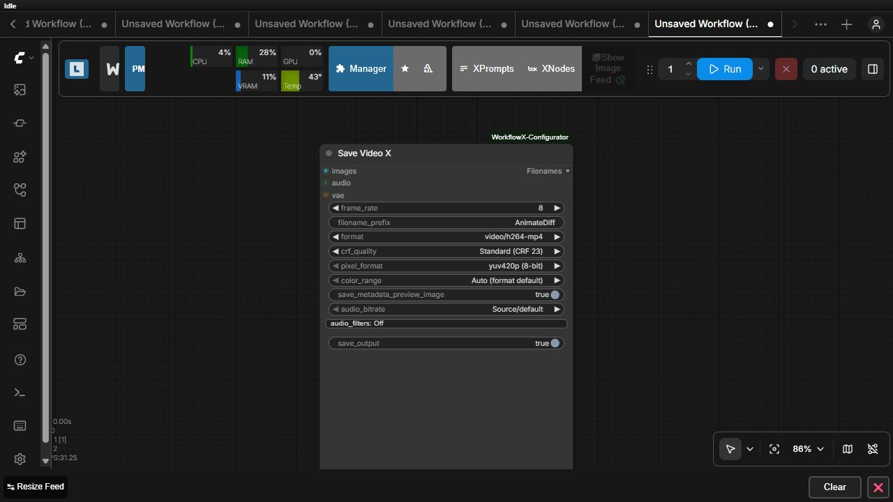

# Save Video X

Save Video X encodes an `IMAGE` batch as a video and can mux optional ComfyUI `AUDIO`.

Choose frame rate, output prefix, container/codec format, CRF quality, pixel format, color range, audio bitrate and filters, and whether to save the output. A metadata preview image can be written alongside the video. The optional VAE input supports formats or preview paths that require decoding context.

The `VHS_FILENAMES` output reports produced files. Available formats depend on the local FFmpeg/ComfyUI environment; invalid frame batches or unsupported encoder settings fail with an actionable error.

See the [local generation example](../examples/02-local-generation-and-model-management.json) and the [exact contract](../README.md#video-output).
