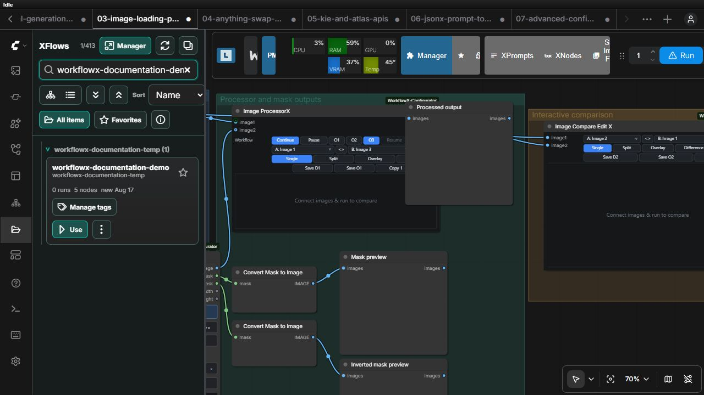
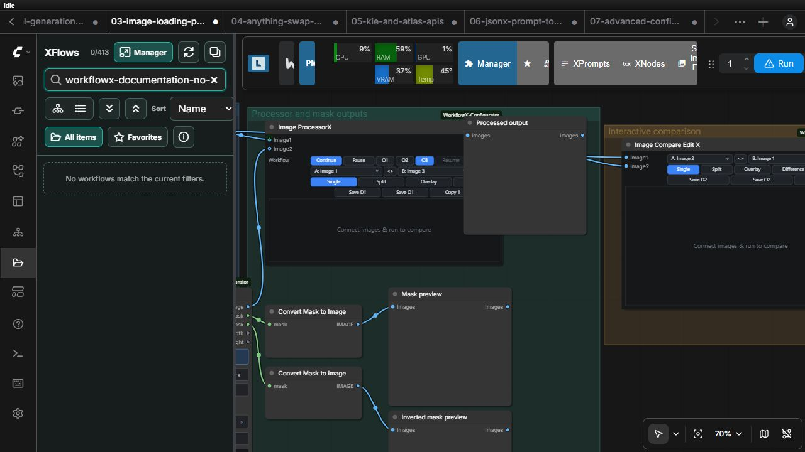

# XFlows

XFlows is WorkflowX's workflow library panel. It provides folder hierarchy, list and card views, tags, favorites, search, move, and duplicate detection without changing ComfyUI's workflow JSON format.

Use neutral, portable names; tag workflows by purpose or dependency; mark frequently used items as favorites; and use duplicate detection before retaining near-identical copies. Move and rename operations update the library organization, not node IDs or workflow serialization.

Library entries can contain local model or path information inherited from a workflow, so review a workflow before publishing it.
