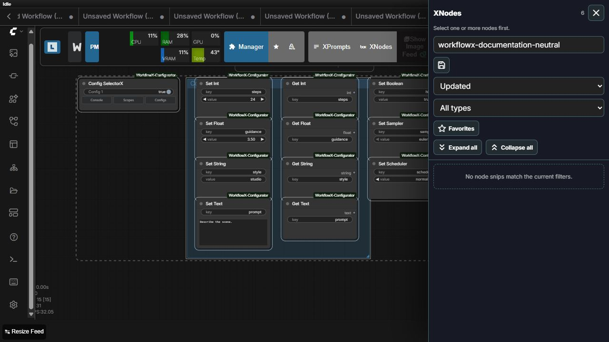
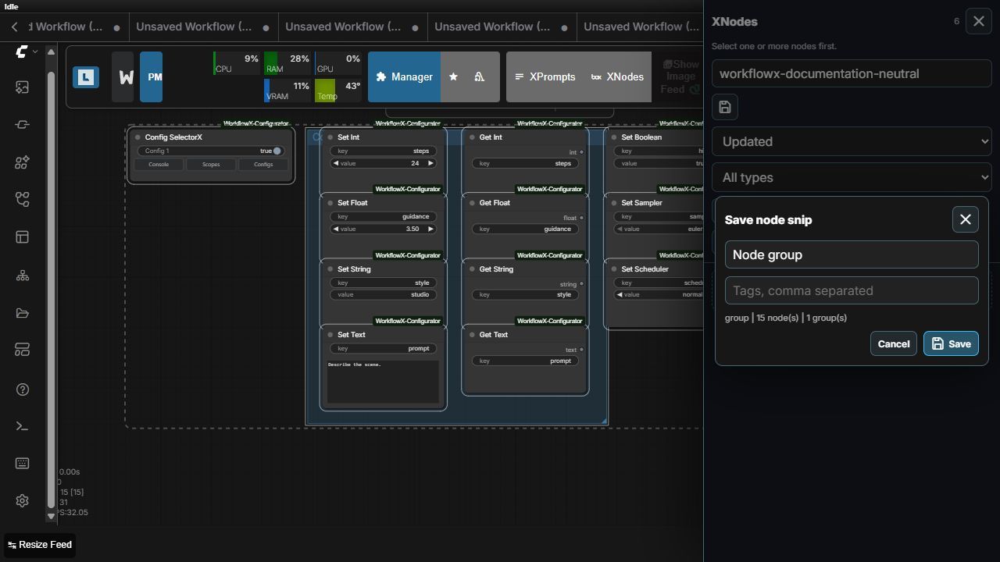

# XNodes

XNodes saves reusable node and group snippets from the current ComfyUI graph.

Current group capture preserves:

- selected ComfyUI groups, including geometry and visual configuration
- every contained node and its widget values
- links whose endpoints are both inside the saved selection
- relative placement needed to reconstruct the selection

External links are not converted into hidden dependencies. After inserting a snippet, reconnect its boundary inputs/outputs and verify local model/file selections before execution.
